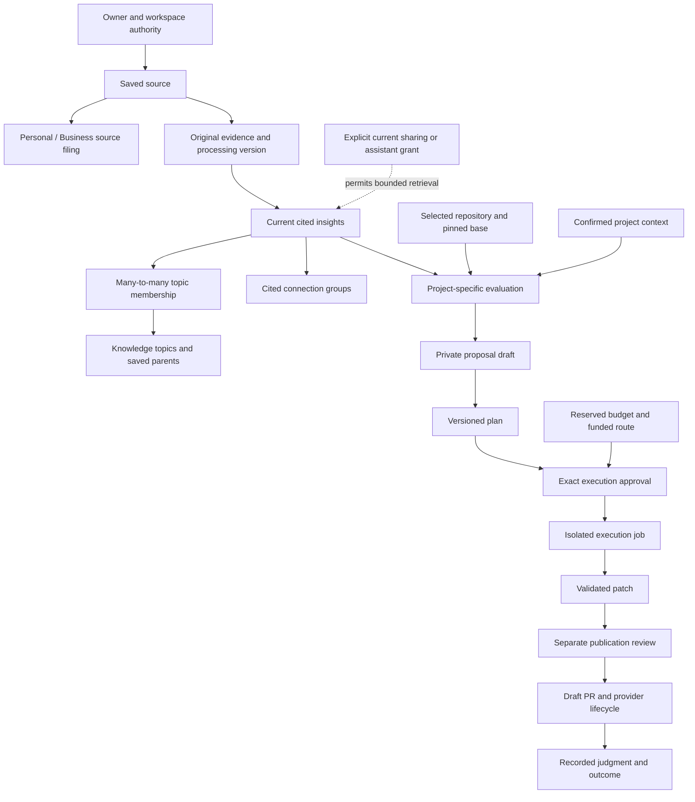

# VibeScroll implementation snapshot, October 8

Mode: reference. This is an evidence-backed inventory, not a new implementation plan or a declaration that full V1 is complete. Audited documentation baseline: `81c08ca21a2f661091e87f0893c9cafa7f12d508`. Later documentation commits can preserve the serving application under ADR 033.

The application has substantial implemented and deployed functionality. The entire evolution plan, all V1 acceptance gates and all UI/UX work are **not complete**. The October 8 [layout options](design/vibescroll-layout-options-20261008.md) are unapproved concepts and are not implemented.

Subsequent owner feedback selected design 2 for Library and design 3 for Projects, five mobile controls with Save centered, overview-first with remembered position, and device-following theme. These are planning decisions in [ADR 094](adr/094-vertical-library-and-project-trail-direction.md) and the [refined UI and UX plan](design/VIBESCROLL-UI-UX-PLAN-20261008.md). Detailed mockup compositions remain proposals. The later bounded existing-app browser review does not implement or validate the redesigned interface.

## October 9 implemented design update

The selected redesign is now released on canonical production at application `e68fc3e52946`, version `0.1.0-alpha.20261009001912.ge68fc3e52946`. Actual populated Library/Home reads and the corrected compact capture keyboard path have bounded production evidence. The older work-needed list below describes the October 8 baseline; items1 and3 are superseded by this update. Unified source/topic semantics, independent experience and external V1 gates remain separate.

The owner has now authorized and the candidate implements the selected Tree/Folders experience, icon-led evidence cards, exact insight-to-project links, five phone controls, device theme, restrained Motion transitions, state-based Home actions/statistics/charts and project-first screens. [ADR 095](adr/095-atlas-shell-and-bounded-visual-workflows.md) supersedes the planning-only boundary above. The dated October 8 inventory remains historical; use [the latest receipt](operations/evidence/vibescroll-atlas-20261009.json) and [implementation status](implementation-status.md) for this candidate's checks and later release result.

| Requested change                                   | October 9 implementation                                                                                                                                             | Acceptance limit                                                                                     |
| -------------------------------------------------- | -------------------------------------------------------------------------------------------------------------------------------------------------------------------- | ---------------------------------------------------------------------------------------------------- |
| Vertical Library tree and expanded Folders         | Implemented over current permitted topic IDs and saved parents, with explicit cursor pages and ancestor navigation                                                   | Synthetic 320–1600px checks; no invented semantic parents or whole-library canvas                    |
| Personal/Business top choices                      | Render only returned scopes; legacy Workspace preserved                                                                                                              | Source filing and insight topic hierarchy remain separate data concepts                              |
| Insight icons, compact evidence and project arrows | Cards retain claims/citations; exact current source+insight evaluations load on request                                                                              | Illustrative arrow fixture is not a real repository fit; missing later evaluation pages are not zero |
| Home stats/graphs and useful action                | State-derived next action first, loaded-cohort stats/readiness/decision charts and bounded topic preview                                                             | Whole-library totals, trends and measured benefit are not fabricated                                 |
| Projects and progress                              | Selected projects/proposals first; setup/scans disclosed; source/plan/run/PR trail derives returned facts                                                            | No new spending or coding approval follows from navigation                                           |
| Theme/navigation/motion                            | Device-following light/dark, five phone buttons with center Save, scoped remembered place, short pointer motion, immediate keyboard and live reduced-motion handling | Physical-device smoothness and independent comprehension remain unverified                           |
| Design review                                      | All eight original material fixes scored resolved by a fresh reviewer                                                                                                | Fix-list approval, not whole V1 approval                                                             |

Remaining external acceptance from the October 8 inventory still applies. This implementation introduces no model-created taxonomy, paid inference, automatic project work or broader grant. Exact deployed-data/version evidence is pending the checked release at this candidate receipt.

## How to read this inventory

- **Implemented:** source and engineering records support the behavior. This does not establish every external journey.
- **Production evidence:** a dated ordinary production interaction supports a specific result, with the stated limits.
- **Partial:** useful behavior exists, but the named requirement or acceptance is incomplete.
- **Unverified:** the required external, independent or physical check has not passed in the records.
- **Deferred or excluded:** a recorded decision limits the current scope. It must not be reported as delivered.

Latest receipts supersede their own earlier pending observations; they do not erase failures or close unrelated gates. No new production login, paid product inference, coding job or live purchase ran for this snapshot. Existing receipts were audited; the production status below is dated evidence, not a fresh browser check.

## Exact application and release evidence

| Item                                    | Recorded result                                                                                                                                                                             |
| --------------------------------------- | ------------------------------------------------------------------------------------------------------------------------------------------------------------------------------------------- |
| Authoritative checkout                  | `C:\Code\VibeScroller\vibe-scroller`; no workspace move                                                                                                                                     |
| GitHub repository                       | `StefanDG1/vibescroll`; history-preserving rename                                                                                                                                           |
| Last recorded serving frontend          | `41a9b286840ed5508c0a10f7c5966fbeec42b790`                                                                                                                                                  |
| Visible application version             | `0.1.0-alpha.20261008013944.g41a9b286840e`                                                                                                                                                  |
| Canonical domain                        | `https://scroll.companynerve.com`                                                                                                                                                           |
| Vercel deployment                       | `dpl_8BfoZnYP7KsHgeUEggzbcKkZTT64`, READY, Frankfurt                                                                                                                                        |
| Hosting policy                          | Fixed Basic 2 vCPU/8 GB; on-demand concurrent builds disabled                                                                                                                               |
| Compatible backend                      | `1db35d26d357990a0b81cad7170b8f6b011e1efe`; Convex `bold-lemur-667`                                                                                                                         |
| Latest ordinary domain/browser evidence | October 8, 01:41 UTC; exact health version, authenticated populated topic at 390/1440 CSS pixels                                                                                            |
| Latest application checks               | `pnpm check`: 539 unit/integration passes, three explicit external skips, 28 authorization passes, Python 6/6/3, five Basic-policy passes, validation/lint/types and both production builds |
| Exact-main CI                           | Verify `37714037287`; version `37714037308`; release `37714217917`, passed                                                                                                                  |
| Dependency result                       | Next.js 16.3.8; zero unresolved findings in dated triage; registry braces advisory locally mitigated, not upstream-fixed                                                                    |

See the [machine-readable release receipt](operations/evidence/vibescroll-visual-dashboard-20261008.json) and the chronological [implementation ledger](implementation-status.md). The table describes the prior application release. Separate checks of this documentation task are recorded in the [design-task receipt](operations/evidence/vibescroll-design-proposals-20261008.json); they do not establish a new deployment or UI acceptance.

## Evolution plan inventory

| Package                                   | What exists                                                                                                                                                                          | What is incomplete or unverified                                                                                                                                                     |
| ----------------------------------------- | ------------------------------------------------------------------------------------------------------------------------------------------------------------------------------------ | ------------------------------------------------------------------------------------------------------------------------------------------------------------------------------------ |
| P0: direction and preflight               | ADRs 075–077, evolution plan, four living foundations through F030, actual access preflight and measured bounded responses                                                           | Independent customer understanding and matched-workload database-I/O/cost evidence                                                                                                   |
| P1: identity, preservation and transition | VibeScroll name in application, history-preserving repository rename, retained local root/domain/configuration, verified all-ref Git recovery and encrypted configuration round trip | Public name/legal clearance; complete production disaster cutover. Keeping the existing folder is deliberate, not a failed migration                                                 |
| P2: private library and sharing           | Owner-private spaces, Personal/Business filing, explicit combined scope, separate team grants, current/versioned authority, correction/deletion fences, export, assistant grants     | Natural-expiry and mixed-derived-evidence acceptance; wider independent privacy/comprehension checks                                                                                 |
| P3: Scroll and visual foundation          | Original Scroll artwork, state wording and shared pose, reduced-motion handling, responsive shell and dialogs                                                                        | Separate expressive artwork for each state, richer celebrations and the newly proposed visual identity                                                                               |
| P4: Home and navigation                   | Consolidated navigation, compact bounded Home, loaded-record statistics, state charts, source-to-project provenance, real evidence links                                             | Whole-library/time-series dashboard, persistent pin/defer actions, richer goal/outcome prioritization; complete new screen architecture                                              |
| P5: onboarding and useful first result    | Resumable focus/goals/interests flow, preview, private capture destination, optional integrations and explicit allowance policy                                                      | One integrated quiz → permitted first post → processing choice → useful result → appropriate upgrade journey; genuine eligible new-user acceptance; personalized plan recommendation |
| P6: knowledge exploration                 | Five current Explore views, saved topic parents, circular cited connection map, page coverage, aliases/manual corrections, evidence inspection and text alternatives                 | Automatically unified vertical Personal/Business category/subcategory tree; independent held-out retrieval, relation quality and comprehension                                       |
| P7: assistant integration                 | Official OAuth/current identity checks, current/future library scopes, read/fetch/intake/status/review tools, judgments/private project drafts, finite Events implementation         | Supported-host Events lifecycle remains unaccepted and Events disabled; provider-revocation coverage and broad external-host acceptance; no claim of public marketplace approval     |
| P8: verification and operation            | Small verified releases, immutable alphas, canonical domain/version, preservation, isolated restoration/resume/rollback records, actual narrow job-to-private-draft-PR evidence      | Remaining independent, provider, quality, commercial, recovery and invoice gates. A successful release is not full V1 acceptance                                                     |

## Original requirements inventory

This table summarizes the current requirement families. Detailed contracts and dated test records remain authoritative for fields, limits and individual operations.

| Requirement              | Current behavior and boundary                                                                                                                                                                |
| ------------------------ | -------------------------------------------------------------------------------------------------------------------------------------------------------------------------------------------- |
| R01 responsive web       | Implemented; selected production/local journeys exercised at 320–1440 CSS pixels. Physical-device and assistive-technology acceptance are not established                                    |
| R02 public website       | Public account, pricing, explanation, documentation, contact and policy routes exist; copy must stay within enabled behavior                                                                 |
| R03 authentication       | WorkOS email-code/Google sessions and recovery have actual evidence. No blanket instantaneous token-revocation claim                                                                         |
| R04 authorization        | Server roles, private ownership and workspace boundaries exist; earlier production rights matrix has 155 tested cases                                                                        |
| R05 capture              | URL, upload and import paths exist with rights review. Telegram is explicitly deferred; platform share support depends on the browser                                                        |
| R06 source access        | Unsupported/private/removed/blocked states and upload fallback exist. Universal retrieval and live Instagram Saved synchronization are not delivered                                         |
| R07 processing           | Bounded restartable media jobs and isolated handling exist. Unknown provider work retains a hold instead of automatic paid retry                                                             |
| R08 transcription        | Original output, corrections, language/version and uncertainty handling exist; this is not independently complete accuracy acceptance                                                        |
| R09 visual understanding | Frame/image evidence and demonstrations are supported; no claim that every frame is reviewed                                                                                                 |
| R10 cited insights       | Main points retain transcript/frame/user-note evidence. Untimed notes remain untimed; interpretations are distinguished from evidence                                                        |
| R11 library              | Browse/search/filter, organization, corrections, export and deletion exist. The new unified visual taxonomy does not                                                                         |
| R12 private reuse        | Workspace-scoped reuse/deduplication exists; actual assistant duplicate-intake replay was exercised without starting processing                                                              |
| R13 repository selection | Explicit app selection is separate from GitHub All repositories permission. Restricted/multiple-installation live acceptance remains incomplete                                              |
| R14 project profile      | Structured/free-text profiles, manual correction and explicit confirmation exist; five owner projects have dated confirmed-profile evidence                                                  |
| R15 repository snapshots | Exact-base context and exclusions/secret safeguards exist. Whole eligible-tree discovery does not mean every file entered a model prompt                                                     |
| R16 selective matching   | Fit/no-fit/already-implemented/unsupported/deferred/needs-context states exist; independent usefulness and wider coverage remain open                                                        |
| R17 proposal review      | Evidence, proposed change and review records exist. Private app drafts and published GitHub issues are different things                                                                      |
| R18 plans                | Versioned editable/exportable plans, acceptance and rollback exist. Exact approval is required before execution                                                                              |
| R19 execution approval   | Repository/base/plan/executor/funding/cap-bound approvals exist; approval to prepare does not approve coding or publishing                                                                   |
| R20 local coding         | Official client/app-server and pairing exist. Windows coding stays disabled following its failed isolation boundary; personal subscription analysis is separate                              |
| R21 cloud coding         | Reviewed funded Vercel microVM execution exists with cancellation and a narrow real journey. Unsupported dependency/check environments can refuse                                            |
| R22 draft PR             | Validated authorized branch/draft publishing exists with exact final-patch review. Product jobs do not automatically merge/deploy                                                            |
| R23 PR lifecycle         | GitHub webhook/reconciliation and distinct draft/open/merged/closed states exist; broader provider lifecycle acceptance remains separate                                                     |
| R24 dashboard            | Loaded-cohort summaries, readiness, provenance and charts exist. Compact Home withholds merge counts when details are not loaded; no global benefit total                                    |
| R25 feedback             | Acceptance/rejection/implementation/merge/reversion/outcome are separate records; judgment does not prove measured benefit                                                                   |
| R26 funding              | Managed metered route, allowance and provider/local-route guards exist. General hosted ChatGPT-subscription use remains disabled; optional provider journeys are not universally accepted    |
| R27 billing              | Catalog/intervals, portal, cancellation/refund/webhooks and entitlement code exist with sandbox evidence and an unpaid live handoff. A real live purchase/refund was deliberately not tested |
| R28 budgets              | Atomic reservations, explicit caps, bounded work and no silent funding fallback exist. Unknown historical holds remain reserved                                                              |
| R29 privacy              | Private defaults, retention, export/deletion and version fences exist. No broad security certification follows                                                                               |
| R30 notifications        | In-app inbox and safe previews exist; email depends on verified delivery configuration. Telegram is deferred; assistant Events remain disabled                                               |
| R31 operations           | Health, kill controls, backups, support, isolated restore/resume and rollback exist. Complete production disaster cutover is not claimed                                                     |
| R32 legal/commercial     | Owner-approved policy manifest, provider register and selected Managed Payments country evidence are recorded. No independent legal review, blanket country support or direct-tax fallback   |
| R33 accessibility        | Keyboard/focus, text alternatives, reduced motion and selected width checks exist. Physical Android is deferred to V1.1; wider AT/human acceptance remains open                              |
| R34 evidence             | Exact source, commands, environment, release/domain and limitations are recorded. Skips and failures remain visible                                                                          |
| R35 provenance           | Source generation/revision/insight references, repository base and plan/patch versions are retained                                                                                          |
| R36 disconnection        | Current authority and revocation fences are implemented. Restricted/multiple-provider and supported-host revocation end-to-end evidence remains incomplete                                   |

## Knowledge extension and actual owner corpus

W01–W07 retain the original library, repository-context, synthesis, exploration, matching, reviewed-publication and release contracts. See [the extension ledger](V1-KNOWLEDGE-EXECUTION.md) and [evolution crosswalk](VIBESCROLL-EXECUTION.md); older pending observations must be read with later receipts.

- October 6 canonical readback recorded **108 genuine analyzed saved sources and 744 insight identities**, with 148 bounded summary pages ready. Insight identities are not 744 independently validated unique facts. This is dated corpus evidence, not a fresh total today.
- Whole eligible-tree discovery and confirmed profiles covered five selected owner projects. Bounded model excerpts retain omissions; this is not unlimited full-repository inference.
- Existing private GitHub issue publication has real provider evidence. A separate batch of **125 current private app drafts** is not 125 published issues; it still requires exact publication and rights review.
- Independent relation-quality, retrieval, comprehension and numerical quality acceptance remain incomplete. Earlier 41 analyses/82 comparisons include 23 qualitatively accepted examples and 18 not reviewed; no defensible universal accuracy percentage follows.

## What the graph actually means today

There are two organizational concepts: filing a whole saved source in Personal/Business/category, and assigning an extracted insight to one or more knowledge topics. A topic can have a saved parent. Cited groups connect current insight references. Project evaluation, proposal, plan, execution and PR records retain their own versions and authority.

The diagrams render those saved records. They do not manufacture missing parents, assume all related ideas agree, or prove a project benefited. A recorded proposal-to-source connection is provenance; a suggested fit is a judgment; a merged PR is an implementation fact; measured improvement needs separate outcome evidence.

The following is a logical view of current relationships, not exact serialized table names. Private-owner and workspace authorization are checked on the server before records are returned.

Saving material does not automatically select a repository. A connected GitHub account does not automatically provide all its code. A proposal does not authorize a plan's execution. A PR merge does not by itself establish benefit. A correction changes the current source reference and can invalidate old sharing, summaries or work inputs instead of rewriting their history.

The latest real topic rendering had twenty ideas, two groups and four cited edges. The inspected topic list had ten roots and zero saved-parent edges. The synthetic hierarchy demo had six topics and five edges. These are different cohorts. A sparse actual tree is not evidence that missing category relationships were implemented.

## Narrow real journeys already proved

- Two **owner-controlled** accounts exercised explicit sharing of one labeled synthetic private cited note. Private retrieval remained denied; grant revocation, source-summary revision invalidation and correctly repeated role removal blocked old access. This is not an independent tester or natural-expiry/mixed-evidence proof.
- Official ChatGPT connection and actual scoped tool reads/intake replay were recorded; native Codex acceptance is also recorded. An assistant connection alone does not give library, spending, coding, publication or repository-code authority.
- October 8 approved synthetic README work produced one exact-byte private draft PR through the isolated route. The retained model result was needs-context; a distinct grounded manual relevance decision enabled subsequent preparation. This does not prove automatic model relevance or general coding usefulness.
- Independent encrypted backup integrity covered 3,354 retained objects; isolated restoration, serving/denial, resume and cleanup have scoped evidence. The real production service was not cut over to the restored environment.

## Money and release boundaries

The [October 3 public release record](operations/paid-release-2026-10-03.md) documents an enabled bounded metered release, owner-approved policies, sandbox billing and an unpaid live Checkout handoff. It would be wrong to describe the project as never released or to claim a successful paid purchase/refund.

The October 8 finish authorization is **EUR 2 cumulative**, not EUR 2 per run. Latest recorded measured inference provision is EUR 0.006161; conservative infrastructure/sandbox/outbound reserves remain separate from cash invoices. The last recorded rounded Convex **team** upcoming estimate was USD 0.57 with USD 15 disable threshold. It is delayed/team-wide, not an attributable task invoice or verified EUR conversion. Unknown historical holds are untouched. Idle monitoring was changed to daily; bounded additional reads can be appropriate during active implementation. No price, cap, hold or funding route was changed for this design task.

Ordinary trial policy records thirty credits and up to three retained captures. The 1,000-retained-source exception applies only to an allowlisted personal owner workspace; it is not 1,000 free analyses or a public trial promise. Managed preparation/analysis uses explicit service-credit reservations and actual settlement; service credits, EUR provider-cost provisions and cash invoices are different records.

## Work still needed for the requested experience

1. Agree the new screen structure and visual direction. The three mockups are illustrative and unapproved.
2. Design a compatible unified hierarchy over source filing and insight topics, including manual corrections, multi-membership, unfiled items and permission-aware scope. Do not infer semantic parents merely to fill the picture.
3. Implement automatic vertical layout, focused branches, responsive insight cards and selected proposal arrows. Existing diagrams are a foundation, not the completed new UX.
4. Finish the integrated first-use/result journey, persistent useful actions and truthful aggregate statistics where genuinely needed.
5. Exercise the remaining provider/expiry/mixed-evidence/independent-quality acceptance. Physical-device scope stays explicitly deferred where decided.
6. Reconcile actual provider invoices and applicable commercial/recovery gates without releasing unknown holds or increasing limits.

V2 autonomous businesses, ads/social accounts, pooled founder subscriptions, private provider endpoints and deferred experiments remain outside this work. No new independent tester was available; that evidence cannot be substituted with the owner's second account.

## What this means for users and the owner

Users can save permitted material, inspect cited insights, organize a private library and review project-specific work through controlled routes. They should encounter explicit unavailable/no-fit/budget states rather than a hidden paid fallback. Assistant access follows a reviewed scope, including future eligible posts where granted, and can be revoked.

The owner has deployed working slices, preserved history/configuration and auditable release evidence. The remaining gap includes real experience design and external acceptance, not just cosmetic polish. There is no need for a login to review these concepts on a phone. A later actual provider consent or independent test still requires the relevant person; advance blanket permission cannot replace an official identity or consent screen.
