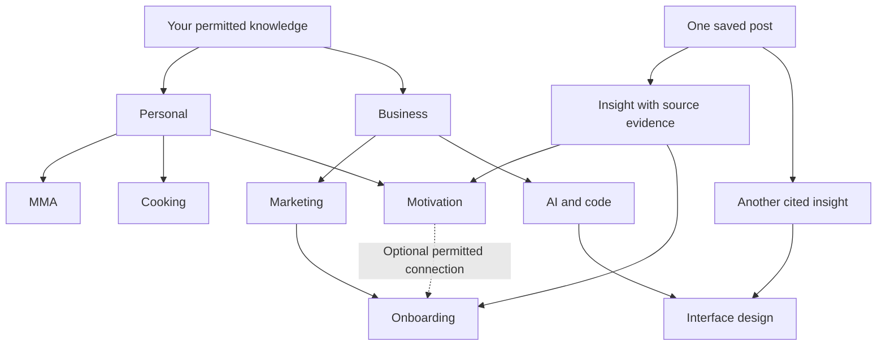
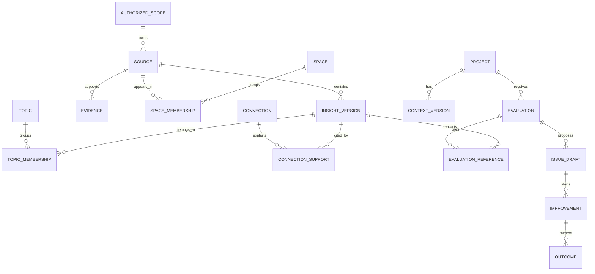
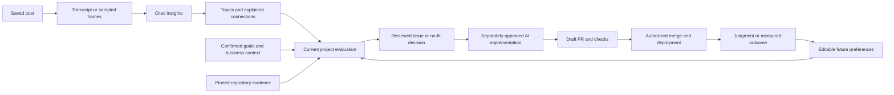
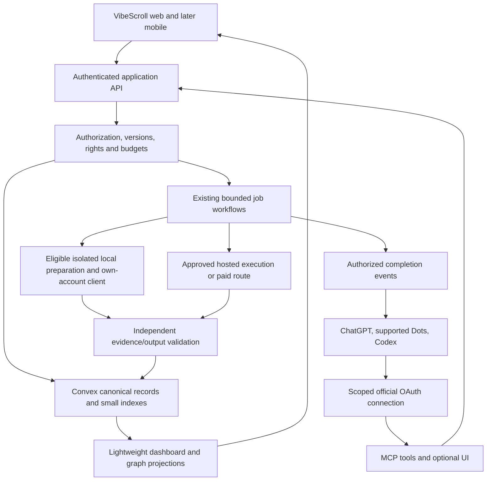

# VibeScroll evolution plan

Mode: proposal and implementation plan. Prepared October 7, 2026. Application changes, rename execution, migrations and deployment are not performed by this document.

## 1. Direction and decisions

VibeScroll helps people turn the useful things they find while scrolling into knowledge they can retrieve, connect to their goals and apply to their projects. Scroll, an original soft illustrated character, makes that process approachable. The main screen is a useful dashboard. ChatGPT and Codex become additional ways to save and use the same knowledge.

The initial commercial audience is adults who own projects and use AI to improve them, including people who never write code themselves. Personal interests make the library useful in daily life; they do not turn this release into a general-purpose life-management service. Project improvement remains the clearest initial outcome.

### Confirmed owner choices

| Choice             | Direction                                                                                                              |
| ------------------ | ---------------------------------------------------------------------------------------------------------------------- |
| Brand              | **VibeScroll**, with that capitalization                                                                               |
| GitHub repository  | Rename the existing repository to **vibescroll**, preserving its history                                               |
| Production domain  | Keep **https://scroll.companynerve.com**                                                                               |
| Character          | **Scroll**, an original soft illustrated creature with expressive eyes                                                 |
| Character presence | Core product identity, always present in the normal product shell and onboarding; no hide-character preference         |
| Home               | Dashboard with useful next actions, readable data and easy navigation                                                  |
| First win          | One real saved post analyzed within a clearly stated free allowance                                                    |
| Knowledge          | Personal and Business spaces, editable categories, multiple memberships and permitted connections                      |
| Defaults           | Useful organization, suggestions and in-app completion updates enabled; consent and spending authority remain explicit |
| Integrations       | ChatGPT/Dots and Codex access to saved knowledge is a priority                                                         |
| Implementation     | Reuse existing functionality and open-source components; preserve owner optimizations                                  |
| This stage         | Research and detailed plan, with no application code                                                                   |

The owner's latest direction supersedes older recommendations for an optional mascot, a chat-first home, a save/search-only home and a permanently neutral interface. The existing dark theme is the initial base; an illustrated character, meaningful mint and warm amber accents replace the exclusively neutral visual rule. A light theme is a separate optional decision, not a prerequisite for this work.

### What stays authoritative

Preserve workspace isolation, manual corrections, rights, evidence coverage, current repository snapshots, confirmed context, versioned approval, funding routes, cost reservations, provider restrictions, deletion and exports. Keep fixed Basic queued Vercel builds. No silent paid fallback, shared founder subscription or automatic public issue publication follows from onboarding defaults.

Keep V1's reviewed issue-to-agent-to-draft-PR workflow and its already specified bounded improvement policies. Any existing merge policy remains subject to its exact authorization and acceptance gates. This redesign must not silently broaden it into unattended publication, merging or deployment. Autonomous business creation, advertising and social-account creation remain V2.

### Baseline inspected

The checkout began clean on `main`, synchronized with `origin/main`, at `0ef91bb`. The owner optimization is merged in `f22c1b2`, PR 49. [ADR 074](adr/074-convex-usage-reduction.md) and the [usage report](operations/convex-usage.md) record the October 6 frontend/backend deployment and compatible data migrations. Their recorded frontend release is `0.1.0-alpha.20261006203437.gf22c1b266c4b`. This planning session has not independently reverified that production version.

The prior completed library run recorded 108 genuine posts, 744 insight identities and 148 ready summary pages, plus evaluations for five projects. These are dated run evidence in [implementation status](implementation-status.md), not freshly queried dashboard counts. The design must accommodate incomplete imports, larger libraries, old history and empty accounts as well.

## 2. Marketing and product focus

### Founder thesis

Include the owner's AI-era argument in the founder story and selected marketing experiments:

> I think AI will change how we work and how much free time we have. If automation gives people more time, some of that time may become more scrolling. I want the useful things we find there to become something we can actually use. That is why I am building VibeScroll.

This is proposed founder copy expressing a belief. Universal basic income, increased leisure and increased doomscrolling are a conditional chain, not an established forecast. The business should also make sense if that future never happens.

The evidence supports widespread social-media use and growth in user identities. It does not establish continuously rising scrolling time per person: DataReportal's 2024 analysis explicitly reported a lower daily average than the preceding year. The 2026 report also distinguishes identities from unique people. Do not equate audience growth, time online, scrolling and doomscrolling. [2024 usage analysis](https://datareportal.com/reports/digital-2024-deep-dive-social-media-is-still-growing), [2026 mid-year report](https://datareportal.com/reports/digital-2026-mid-year-global-update-report).

Do not write that all technology leaders agree, that scrolling is the only activity left in the AI era, or that an individual endorses VibeScroll. A named Musk quotation needs its original verified source and context before use. No such quotation is required for the proposed positioning.

### Message hierarchy

| Placement               | Proposed message                                                                                   | Evidence required before publication                                             |
| ----------------------- | -------------------------------------------------------------------------------------------------- | -------------------------------------------------------------------------------- |
| Brand line              | **Make scrolling useful.**                                                                         | Positioning, not a measured result                                               |
| Main product promise    | **Give your saved ideas somewhere to go.**                                                         | Actual save, knowledge and retrieval journey                                     |
| Supporting explanation  | Save a post. Find the useful ideas. Connect them to what you care about and what you are building. | Enabled and verified feature paths                                               |
| Project-focused section | See why an idea fits your project, then review what to do with it.                                 | Current code evidence and honest no-fit cases                                    |
| Founder story           | Conditional AI/free-time thesis above                                                              | Clearly attributed personal belief                                               |
| Assistant connection    | Bring your saved knowledge into your conversations with ChatGPT.                                   | Real supported account/client acceptance; no claim of access to all chat history |
| Outcome section         | Keep track of what you tried and whether it helped.                                                | Distinct judgment and measurement records                                        |

Scroll is the friendly guide associated with that promise. Avoid shame about scrolling, guaranteed income, exaggerated hours saved, fabricated testimonials or gamification that rewards spending more time in the feed. Celebrate using an idea, making a considered decision and finding a relevant source.

### Foundation changes to make during implementation

Read and update [Research](foundational/VibeScroller_Foundational_Research.md), [Avatar](foundational/VibeScroller_Foundational_Avatar.md), [Offer](foundational/VibeScroller_Foundational_Offer.md) and [Beliefs](foundational/VibeScroller_Foundational_Beliefs.md) together under the [copy and idea process](foundational/COPY-AND-IDEAS.md). Preserve cited dissent and unresolved evidence.

| Existing brief                                | Update required                                                                                               |
| --------------------------------------------- | ------------------------------------------------------------------------------------------------------------- |
| VibeScroller name and selected motto          | VibeScroll name; proposed useful-scrolling language; update links safely                                      |
| Developer/technical founder as primary avatar | Project owner using AI, including a non-coding owner; technical users remain a segment                        |
| Saved content against a repository            | Keep that concrete outcome; add personal organization and portable assistant retrieval as supporting value    |
| Quiet neutral console                         | Friendly character-led dashboard with fewer competing controls                                                |
| Productivity and conversion hypotheses        | Add conditional AI-era thesis and onboarding hypotheses to the idea backlog, not the factual research section |
| Six foundational beliefs                      | Preserve evidence, agency and honest outcomes; revise language only where this direction changes the brief    |

Public trademark/name clearance remains a branding release check. The user's name selection is confirmed; availability or registrability is not established by selecting it.

### Distribution and measurement

Lead with demonstrations: a real permitted post becomes cited insights, a relevant project suggestion and a recorded outcome. Secondary demonstrations can show a cooking or MMA collection and a permitted connection to a business idea. Use public-safe material or explicit permission for owner content.

Test a practical saved-ideas message against the conditional AI-era story. Judge activation, retained use, willingness to pay and understood value; click-through rate alone cannot establish product demand. Use consented, minimal funnel events. Content, transcripts, repository files and quiz answers must stay out of analytics payloads and session recordings.

## 3. Existing saved insights and reusable tools

### Evidence found in the owner's library

The first inspected export was older and contained titles/captions without analyses for several relevant posts. The newer completed local analysis artifacts contain sampled-video interpretations for the following sources. These were read without new inference or production batch processing. They are source-backed inspiration, not independent tests of the creators' numerical claims.

| Saved source                                                                          | Lesson for VibeScroll                                                                          | Qualification                                                                                              |
| ------------------------------------------------------------------------------------- | ---------------------------------------------------------------------------------------------- | ---------------------------------------------------------------------------------------------------------- |
| [Onboarding framework](https://www.instagram.com/reel/Dd1-6QVyOs8/)                   | Promise, short quiz, visible personalized result, then purchase decision                       | Sleep-app example; no measured conversion result                                                           |
| [Explain each onboarding step's benefit](https://www.instagram.com/reel/DdVEHz1xQEW/) | Questions should visibly improve the user's setup                                              | Reported Duolingo figures conflict between transcript and graphic                                          |
| [Jane onboarding redesign](https://www.instagram.com/reel/DduRXwgupNB/)               | Let the user try something, recognize the first achievement, explain notifications when useful | Small early cohort; improved conversion was not demonstrated                                               |
| [Onboarding paywall claims](https://www.instagram.com/reel/Dc1s4nzycvQ/)              | Price timing is worth testing after value is understandable                                    | Observational creator claims do not prove an uplift for this app                                           |
| [000h React components](https://www.instagram.com/reel/DdwYthzIdF5/)                  | Expressive controls can complement coordinated components                                      | Catalog and styles are visible; compatibility requires integration checks                                  |
| [Interactive website mascots](https://www.instagram.com/reel/DdRZhKHoRvJ/)            | `nilbuild/page-mascot` provides the identified character interaction reference                 | Completed analysis identifies the repository; current primary documentation was also checked               |
| [Mascot design skill](https://www.instagram.com/reel/Dd18vJ8OH_U/)                    | Simple rounded silhouettes and a small purposeful palette                                      | Analysis identifies `s1dashu/ip-as-logo-skill`; candidate art still needs owner selection and asset review |
| [UI design workflow](https://www.instagram.com/reel/DdOpzseIDUb/)                     | Establish tokens and a few well-reviewed components before expanding                           | Workflow heuristic, not an automatic quality guarantee                                                     |
| [UI tools and critique](https://www.instagram.com/reel/Dd4fm_9tMHH/)                  | Coordinated components, design critique and browser observation                                | Tool existence does not certify generated interfaces                                                       |
| [Liquid-gooey React effects](https://www.instagram.com/reel/Dco0yUcxeUW/)             | Interesting interaction reference for a limited visual experiment                              | Safari, accessibility and performance claims need verification; exclude from the initial core controls     |

Adapty's own 2026 report commentary supports investigating early monetization and onboarding, but does not establish that a GitHub connection causes conversion or that a longer quiz helps this product. [Adapty's discussion](https://adapty.io/blog/subscription-app-success-2026/). The owner selected a real first result before the payment request; implement that decision and measure it.

### Recommended frontend stack

Keep the existing Next.js, React, TypeScript, Tailwind, Lucide, Radix, WorkOS and Convex foundation. Existing `@companynerve/ui` already exports Button, Input, Label, Textarea, Select, Card and Badge and uses Radix. Extend that shared layer rather than building a parallel kit beside it.

| Tool                                                                                                     | Use                                                                                               | Decision                                                                                                                                                                    |
| -------------------------------------------------------------------------------------------------------- | ------------------------------------------------------------------------------------------------- | --------------------------------------------------------------------------------------------------------------------------------------------------------------------------- |
| [shadcn/ui](https://github.com/shadcn-ui/ui)                                                             | Accessible primitives, command/search, sheets, dialogs, tabs, forms and consistent states         | Recommended base; copy/adapt only needed components; [MIT](https://github.com/shadcn-ui/ui/blob/main/LICENSE.md)                                                            |
| [000h by Cojeev](https://github.com/luv-jeri/cojeev-ui), [live catalog](https://000h.cojeev.com/)        | A few expressive interactions, illustrated onboarding accents and selected mobile drawer behavior | Recommended selectively; unify tokens and semantics; [MIT code](https://github.com/luv-jeri/cojeev-ui/blob/main/LICENCE), retain font/icon notices                          |
| [page-mascot](https://github.com/nilbuild/page-mascot), [gallery](https://koboyo.com/page-mascot)        | Sprite-based pointer/tap character reactions                                                      | Preferred runtime candidate; [MIT](https://github.com/nilbuild/page-mascot/blob/main/LICENSE); use original Scroll artwork                                                  |
| [IP as Logo skill](https://github.com/s1dashu/ip-as-logo-skill)                                          | Guidance for creating simple original character concepts                                          | Optional art preparation; MIT repository; not installed or executed in this stage                                                                                           |
| [shadcn charts](https://ui.shadcn.com/docs/components/chart) and [Recharts](https://recharts.github.io/) | Topic distribution, outcome history and small progress charts                                     | One chart system, lazy loaded; no new custom chart engine                                                                                                                   |
| [React Flow](https://github.com/xyflow/xyflow)                                                           | Focused connections, evidence pathways and node interaction                                       | Add only if the existing map cannot meet the approved interaction; [MIT core](https://github.com/xyflow/xyflow/blob/main/LICENSE); do not assume paid examples are included |
| Existing CSS and browser animation                                                                       | Feedback, state transitions and most character behavior                                           | Default; avoid a new animation dependency for basic transitions                                                                                                             |
| [Official MCP TypeScript SDK](https://github.com/modelcontextprotocol/typescript-sdk)                    | Assistant connection protocol                                                                     | Pin a reviewed compatible release and its actual licenses; verify Events support separately                                                                                 |

The current 000h site was inspected in Chrome on October 7: dark background, rounded white primary action, soft organic forms and restrained character details. Earlier public Muse/Dots interface images were inspected as character and hierarchy references. Those are references, not owned product sessions or permission to reuse their artwork. Muse/Dots inspire approachable presence and concise interactions, not a chat-first VibeScroll layout.

Do not install every attractive component catalog. Avoid WebGL backgrounds, particle fields, force simulations, liquid effects on evidence text and persistent animation in ordinary reading. Open-source code reduces implementation effort; each adopted component still needs security, accessibility, version compatibility and license checks.

### Design skills and workflow

Use Impeccable to shape the experience and critique cognitive load, existing frontend-design guidance for a coherent component system, and browser-harness for real browser observation. Use OpenAI documentation guidance for the connector contract. Load implementation-specific skills when that stage begins; do not run overlapping design agents, repeated full audits or install every skill mentioned in a post.

Make one approved visual direction and reusable examples for the home, onboarding, a topic and an issue review. Inspect mobile and desktop together, fix the identified problems in one batch and confirm once. Expand QA only for a new defect or changed behavior. Do not turn polish into an unlimited resource-consuming loop.

## 4. Visual directions and selected recommendation

These are composition options, not three different backend architectures. The preferred proposal is A. The user has confirmed the character style and dashboard purpose, but has not yet reviewed an actual screen mockup.

| Direction               | What the first screen feels like                                                                               | Best use                                                          | Main risk                                                                  |
| ----------------------- | -------------------------------------------------------------------------------------------------------------- | ----------------------------------------------------------------- | -------------------------------------------------------------------------- |
| **A. Scroll's studio**  | Scroll greets the user beside one useful next action; a compact library overview and project results sit below | Recommended home and onboarding; friendly, clear and marketable   | Can become a generic grid if every item becomes a card                     |
| **B. Knowledge garden** | Expandable topic branches and a small neighborhood of related insights; Scroll guides exploration              | Library's Explore view and personal interest discovery            | Metaphor can hide exact content and permissions; dense maps confuse phones |
| **C. Project journal**  | A readable story of saved idea, decision, implementation and result, organized around projects                 | Project detail and outcome review; non-coders can follow progress | Weaker immediate overview of personal knowledge if used as the entire home |

Use A for home, B as an explicit explorer and C inside projects. All inherit one palette, typography, icon family, spacing and character. This is one product with different useful views.

Alternative design exercises considered a field notebook, a project cockpit, a learning timeline and a personal shelf. A pure cockpit retains too much administrative density; a timeline loses topic structure; a shelf makes retrieval pleasant but hides project outcomes. Abstract editorial/exposure-record visual systems offer strong hierarchy but do not match this audience's easy, character-led task. Keep their discipline of clear grouping and honest conflicting evidence rather than importing decorative motifs.

### Durable visual rules

- Dark charcoal remains the starting canvas. Mint identifies active knowledge and useful navigation. Warm amber marks the character and opportunities needing attention. Status always includes text/icon, not color alone.
- Scroll uses a simple, recognizable silhouette and two purposeful character colors. Expressiveness comes from eyes, posture and small reactions. Keep consistent proportions across favicon, shell, onboarding and illustrations.
- Familiar readable type, clear titles, generous spacing and short explanatory text. Remove redundant subheadings and repeated background explanations. Use concise headings where they improve navigation.
- Use a small number of visual containers. Evidence reading should feel like reading, not nested boxes within boxes.
- One obvious next action per important state. Secondary actions remain easy to find in a menu or disclosure.
- Icons keep labels or accessible names. Update icons by meaning, not decoration; never make unrelated statuses use the same ambiguous sparkle.
- Notifications confirm an actual completed operation. A toast cannot be the only explanation of a failed job, required approval or spending decision.
- Reduced motion leaves Scroll visible and still. Touch devices use deliberate taps; no hover-only character behavior. No full-screen character overlay, focus theft or obstruction of the keyboard.

### Character behavior

| State              | Character behavior                      | Functional explanation                                              |
| ------------------ | --------------------------------------- | ------------------------------------------------------------------- |
| First visit        | Curious greeting next to the first task | One sentence explaining what the user can do                        |
| Saving             | Brief acknowledge reaction              | Saved receipt and actual processing state                           |
| Processing         | Calm waiting/thinking illustration      | Real status; no fabricated percentage or pretend live thought       |
| Useful result      | Small delighted reaction                | Direct path to cited ideas                                          |
| Approval needed    | Attentive still pose                    | Exact action, funding and approval boundary                         |
| Unavailable source | Supportive neutral pose                 | Retry/upload/keep link options, according to actual failure         |
| Outcome recorded   | Small celebration                       | Recorded judgment or observation, not a claim of proven improvement |
| Idle/background    | Static or very infrequent local blink   | No model calls, sound or server heartbeat for animation             |

Scroll stays in the shared shell; on focused reading/review screens it becomes a compact anchor rather than a large hero. Full-screen evidence viewers can prioritize the evidence and native close control without turning that into a hide-character setting. Character speech repeats concise real state, never gives authority or substitutes for mandatory disclosures.

## 5. Navigation and dashboard

### Primary destinations

| Destination  | Contains                                                                                               | Reuses                                                                     |
| ------------ | ------------------------------------------------------------------------------------------------------ | -------------------------------------------------------------------------- |
| **Home**     | Useful next action, capture, library snapshot, project progress and outcome follow-up                  | Existing capture/status and improvement records                            |
| **Library**  | Posts, insights/topics, search, categories and Explore modes                                           | Source reading, knowledge summaries, corrections, current map and evidence |
| **Projects** | Repository connection, business context, relevant ideas, issue reviews, plans, agent work and outcomes | Current project/profile/evaluation/issue/improvement flows                 |
| Account menu | Billing/usage, connections, privacy/export/deletion, team and advanced execution settings              | Existing operational pages and role checks                                 |

On mobile, Home, Library and Projects are persistent navigation items with a clearly accessible Save action. Account controls stay available in the header. Desktop uses a compact rail/sidebar. Workspace and Personal/Business selection always show which data is being viewed.

Consolidate inbox, proposals, plans, runs and improvements into contextual project views and a compact activity/review queue. Keep old deep links working through redirects or compatible route entry. Do not remove exports, pending approvals, failed work, billing, corrections, role administration or unsaved editors while simplifying navigation. Operational diagnostics belong behind advanced disclosure with useful user-facing errors on the actual task.

### Proposed dashboard composition

```text
Desktop
┌─────────────┬────────────────────────────────────────────────────┐
│ Home        │ Workspace / Personal + Business       Account      │
│ Library     ├────────────────────────────────────────────────────┤
│ Projects    │ Scroll       One useful next action                 │
│             │              [Review / Continue / Explore]          │
│             │ [Paste or save a link]                              │
│             ├─────────────────────────┬──────────────────────────┤
│             │ Your knowledge          │ Your projects            │
│             │ Small topic overview    │ Changes and next reviews │
│             │ [Explore]               │ [Open project]           │
│             ├─────────────────────────┴──────────────────────────┤
│             │ Worth revisiting / What helped / Recent activity   │
└─────────────┴────────────────────────────────────────────────────┘

Phone
Workspace + Account
Scroll + one useful next action
Save a link
Knowledge overview → Projects → Outcome follow-up
Home | Library | Save | Projects
```

Wireframe is a layout proposal, not a rendered app or acceptance evidence. Show fewer modules for a new account; do not present a wall of zero metrics. A returning user should immediately find the thing awaiting their judgment, newly completed knowledge or a useful next exploration.

### Adaptive priority without expensive inference

Rank a bounded set of candidate modules using existing state and explicit preferences: required approval or recoverable failure, requested work that finished, an outcome review due, a relevant idea for a pinned goal, then recent/related knowledge. Let the user pin or dismiss modules. Explain a suggestion with a short reason.

Compute that ordering with deterministic rules first. Do not generate the home layout with a model or reprocess content on every visit. Keep navigation, Save and core dashboard anchors stable; defer reorder while the user is interacting. Readiness/deployment updates may update their existing row without moving everything.

### Metrics and useful questions

| User question              | Display                                   | Definition and limit                                                                  |
| -------------------------- | ----------------------------------------- | ------------------------------------------------------------------------------------- |
| Where are my ideas?        | Topic bars or a bounded category tree     | Counts of accessible current insights; topic overlap means totals are not additive    |
| What can I use?            | Relevant ideas and confirmed project fit  | Distinguish investigated recommendation from unverified hypothesis                    |
| What did I implement?      | Project progress/timeline                 | Draft, published issue, PR, merged and deployed are separate states                   |
| What helped?               | Outcome cards and trend view              | Separate owner judgment from measured results; unknown remains unknown                |
| Which posts were useful?   | An explainable ordered list               | User ratings and recorded applications/outcomes; views/saves alone are not usefulness |
| What still needs analysis? | Coverage/status summary and direct action | Saved, queued, ready, incomplete and failed; no fake complete-library percentage      |
| What needs me?             | Compact review queue                      | Missing consent, approvals, context review and recoverable external failures          |

For multi-source changes, show contributed-to outcomes or use a clearly labeled fractional count. Never credit every supporting post with an entire independent improvement. Measure baseline and observation windows, sample counts, deployed version and limitations. A before/after change suggests an association; causal claims need a suitable experiment or stronger evidence. Do not compare personal and business usefulness using one unexplained score.

Initially collect outcomes through the existing owner judgment/measurement workflow. Add read-only analytics integrations only when an actual project needs them and its user connects them. Do not connect every possible analytics provider in onboarding.

## 6. Onboarding that produces a useful first result

### Sequence

Use a short branching quiz with a visible setup preview, back navigation and saved progress. Each answer changes a named piece of setup or is omitted. Do not stretch the quiz simply to increase sunk cost.

| Step                            | User sees/answers                                                                               | Stored result                                                     | Immediate benefit                                                         |
| ------------------------------- | ----------------------------------------------------------------------------------------------- | ----------------------------------------------------------------- | ------------------------------------------------------------------------- |
| 1. Meet Scroll                  | One useful promise; primary Start action; account creation when persistence is needed           | Account/workspace under existing identity                         | Understand the product without a permission wall                          |
| 2. Choose your focus            | Personal, Business or both; recommended useful features explained briefly                       | Space preferences and private setup preview                       | Relevant next steps and clearly understood boundaries                     |
| 3. What are you working toward? | One primary goal; optional interests and project role                                           | User-stated goals/interests; provenance and editable confirmation | Quiz answers visibly populate the setup preview                           |
| 4. Bring one useful thing       | Paste link, upload permitted media or use a clearly labeled sample                              | One canonical source and explicit rights handling                 | Own content starts becoming useful                                        |
| 5. Choose processing            | Available funding route, estimate/allowance and cap; own account/local option when eligible     | Versioned processing grant                                        | Understand cost and availability before processing                        |
| 6. Optional project setup       | Connect selected GitHub repositories or describe a project without GitHub; review context draft | Existing repository/profile workflow                              | Connect knowledge to a real goal, without choosing files/folders manually |
| 7. First result and next step   | Cited ideas, useful categories, one next action; optional connection to ChatGPT                 | Reviewed setup and first-use result                               | See actual value before the payment request                               |

The shortest Personal route skips GitHub and reaches the real result quickly. Business setup can continue while analysis runs, but must not delay showing a completed result. Processing duration is honest; do not promise instant retrieval/transcription for every social link. If the source is unavailable, preserve the link and offer a permitted upload or useful sample; do not pretend the sample is the user's video.

Use the existing verified-account preview policy of at most three sources and 30 credits with its global trial-spend ceiling; the onboarding promise is one eligible real post within that allowance. Reserve cost before starting. If a video exceeds the allowance, explain the estimate and offer an eligible smaller source or approved alternative before spending. No automatic conversion to a paid plan. Any change to allowance or trial funding requires an explicit billing decision and a validated cost model. [Billing and tax](BILLING-AND-TAX.md).

Proposed wording: "Tell Scroll what you want to use your ideas for" and "Your answers shape your library." The interface must actually use the answers in visible setup. Avoid promises about life transformation or automatic improvement.

### Quiz design and profile evolution

Collect role, goal, interests, chosen projects and preferred way of applying ideas. Use a few meaningful choices and an optional own-answer field. Ask about a project target audience only where it helps its context; roles such as parent, educator, student, buyer and administrator remain explicit business audiences rather than being flattened into one generic user.

Personal facts, preferences, source claims and system guesses are distinct. Quiz answers have user provenance; extracted advice is not a fact about the user. A cooking video cannot establish a dietary requirement; an MMA save cannot establish a health condition. Suggested goals require confirmation. Sensitive profile processing needs its own documented basis and controls; avoid unnecessary sensitive questions.

Maintain confirmed profile versions plus editable suggested changes. Rejection/defer decisions and outcome feedback may inform recommendations under the chosen purpose, but cannot silently overwrite confirmed business context or manual categories. Provide "Why this suggestion?" and easy correction. Expiry/reconfirmation makes changing priorities visible.

### Connections and defaults

| Feature                                                             | Initial behavior                                                                    |
| ------------------------------------------------------------------- | ----------------------------------------------------------------------------------- |
| Organize saved content and suggest editable categories              | On                                                                                  |
| Useful in-app suggestions and completion updates                    | On, adjustable                                                                      |
| Relate Personal and Business for the same private owner             | Recommended/on selection disclosed in onboarding; save the owner's confirmed choice |
| Share Personal material with a business/team workspace or assistant | Separate explicit scope selection; off until granted                                |
| Analysis after saving                                               | Automatic only under an enabled eligible route and bounded grant                    |
| GitHub/OpenAI authentication                                        | User completes actual provider consent; no pre-granted permissions                  |
| Public issue publication, coding, merge/deploy authority            | Existing separate exact approvals/policies                                          |
| Marketing messages and nonessential analytics                       | Consent as applicable; no prechecked consent                                        |
| Browser/native push                                                 | Explain value first, then user/system permission; denial does not block the library |

The user's "all on by default" preference applies to useful product behavior. It cannot manufacture provider consent, spending permission or permission to expose private data. Existing users receive an explained preference choice; do not silently change their sharing boundaries during migration.

"Connect ChatGPT" means connecting the VibeScroll plugin to a supported ChatGPT account for retrieval/actions. It does not mean giving VibeScroll the subscription's inference credentials or chat history. Eligible own-subscription local processing remains a separately approved official-client session. These are different connections and need distinct explanations.

### Paywall, investment and legality

Connecting an account during onboarding is not inherently prohibited. Design it to serve the selected feature, disclose the purpose and let the user skip unrelated setup, unlink and delete. Increased investment may improve conversion; that is a testable hypothesis, not a reason to conceal prices or obstruct leaving.

When consent is the legal basis, GDPR requires a real, specific, informed choice and easy withdrawal. Unnecessary data processing cannot simply be bundled into access to the service. Determine the correct basis for each purpose rather than calling all processing consent. [EDPB guidance](https://www.edpb.europa.eu/sme/be-compliant/process-personal-data-lawfully_en), [consent conditionality](https://www.edpb.europa.eu/sites/default/files/files/file1/edpb_guidelines_202005_consent_en.pdf).

Use an honest price preview, allowance, renewal interval and cancellation path. Do not imply that connecting GitHub commits the user to payment or use a distressed Scroll to discourage cancellation. EU enforcement covers hidden subscription terms, misleading hierarchy and false urgency. [Commission dark-pattern enforcement](https://commission.europa.eu/topics/consumers/consumer-rights-and-complaints/enforcement-consumer-protection/sweeps_en), [recurring subscription traps](https://commission.europa.eu/topics/consumers/consumer-rights-and-complaints/enforcement-consumer-protection/coordinated-actions/consumer-frequent-traps-and-scams_en).

Future native apps need a storefront-specific purchasing design. Apple generally requires in-app purchase for digital functionality, with storefront/program exceptions; its login rule concerns third-party authentication of the primary account, not every optional GitHub connection. Account deletion must be available. Do not assume a web checkout embedded in a wrapper qualifies. [Apple guidelines](https://developer.apple.com/app-store/review/guidelines/), [deletion guidance](https://developer.apple.com/support/offering-account-deletion-in-your-app/).

Google Play similarly has digital-payment rules with exceptions and programs. It requires appropriate disclosures, permission/consent handling and account deletion paths, including a web route. Third-party AI integrations remain the developer's responsibility. [Payments](https://support.google.com/googleplay/android-developer/answer/10281818?hl=en-en), [user data](https://support.google.com/googleplay/android-developer/answer/10144311?hl=en-GB), [account deletion](https://support.google.com/googleplay/android-developer/answer/13327111?hl=en).

These sources inform the design as of October 7, 2026; they are not legal clearance or store acceptance. Before commercial release, review the implemented flow and actual merchant/privacy disclosures with qualified advice where required by the existing release gates. Keep the web product useful now; a native app is later distribution work.

## 7. Knowledge organization and connections

### Explain it to a user

A **post** is what you saved. An **insight** is a useful claim or lesson extracted from it, linked back to its evidence. A **topic** groups insights. A **connection** explains how insights relate. A **project** adds the real business/code context. An **outcome** records what happened after you tried an idea.

Personal and Business are useful views of permitted content. One post can contribute to several topics and both views; it is not copied and analyzed again merely because it has two labels. Labels alone do not grant access to private content.



Illustrative tree, not a query of the owner's actual library. It shows why a strict single-parent folder tree is insufficient: an insight may belong to several places. The UI can present a friendly tree while storing memberships and explicit relationships.

### Current model versus changes

Convex provides a relational data model using JSON-like documents, IDs and indexes, with TypeScript query/mutation functions rather than SQL. That is suitable for an evidence graph without adopting a separate graph database. [Convex database documentation](https://docs.convex.dev/database/overview).

The current browser path uses authenticated application endpoints and controlled polling; it is not already a direct subscription to a complete global graph. Preserve that fact when discussing the connection type. Lightweight authenticated reactive queries could later replace selected polling after measurement and authorization testing; they are not inherently free.

| Layer                 | Existing representation                                                              | Planned adaptation                                                                                                          |
| --------------------- | ------------------------------------------------------------------------------------ | --------------------------------------------------------------------------------------------------------------------------- |
| Sources/evidence      | `sources`, embedded analysis/insight IDs, private evidence assets                    | Keep canonical evidence and exact versions; separate large payloads from lightweight browsing metadata only where justified |
| Filing                | Workspace categories, source categories, overrides/tags                              | Add Personal/Business membership and clear privacy scope; retain manual filing                                              |
| Meaning               | `knowledgeTopics`, `knowledgeMembers`                                                | Reuse topic identities and insight membership; distinguish filing from extracted meaning                                    |
| Synthesis/connections | `knowledgeJobs.output` with cited relation groups                                    | Expose existing relations faithfully; normalize only useful current relations into lightweight indexed records              |
| Project fit           | `knowledgeEvaluations`, repository metadata, `repositoryContent`, confirmed profiles | Reuse current SHA/profile/selection/preference fences and inspected code evidence                                           |
| Action                | `issueDrafts`, publication attempts, proposals/plans, runs, improvements             | One navigable chain; separate each authorization boundary                                                                   |
| Result                | `improvementOutcomes` with judgment/measurement fields                               | Reuse and visualize; extend personal application tracking only where needed                                                 |
| Overview              | Existing lists/count fields                                                          | Bounded, permission-aware dashboard projection; no repeated full evidence reads                                             |

Existing similar/complementary/conflicting relations are cited groups inside bounded summary outputs. They are not a fully normalized universal pairwise graph or proof of causation. Do not label existing map coverage as the entire "brain."

### Conceptual relational diagram



Conceptual entities are not a directive to create a table for every box. Existing contracts and tables remain the starting point. Plan only the missing relations/projections after profiling actual access patterns.

### Connection contract

Each useful connection needs a type, a concise explanation, exact supporting insight references, derivation origin, evidence/processing versions and currentness. Reuse similar, complementary and conflicting semantics before adding types. Filing membership, similarity, contradiction, project applicability and observed outcome are distinct relationships.

References retain `(sourceId, generation, revision, insightId)`. A change to evidence, manual interpretation, rights, visibility or deletion invalidates dependent derived material. Do not relink an old conclusion to a new analysis just because the title matches. Source claims remain attributed; an attractive graph must not turn them into verified facts.

Use normalized identities for a term and aliases for naming variations. Suggested category creation is editable, deduplicated and bounded; begin with a manageable category/subcategory structure rather than generating dozens of empty branches. Topic merge/split preserves redirects, revisions and user corrections. Manual labels outrank suggestions. A rejected connection stays rejected for that evidence version unless the user requests reconsideration.

### Personal, business and sharing boundaries

Separate **ownership/authorization scope** from **space membership**. Workspace labels cannot provide personal privacy when every workspace member can read the underlying source. A private personal area needs enforced per-user/private-scope authorization before storing personal material there.

For the initial single-owner account, both views can draw from the same authorized private library with multiple memberships. Team business work uses its own permitted scope. Deduplicate content within its authorization domain; never deduplicate by exposing another tenant's saved source. A source may be associated with both spaces for its owner without becoming visible to teammates.

"Connect my spaces" controls private owner retrieval/suggestions. "Share personal knowledge with this workspace/assistant" is a separate scoped grant. Derived summaries and edges must be readable only when their cited private inputs are authorized for that reader. Private topic names, counts, thumbnails and cached summaries must not leak through mixed-scope aggregates.

Disabling cross-space connections immediately filters them from views, assistant responses and new work. Enabling them reuses valid existing summaries and proposes bounded work for missing relationships if required. It does not authorize a whole-library rerun. Already disclosed material in a third-party conversation cannot be guaranteed retractable; explain the scope before sharing and stop future retrieval on revocation.

### Build a useful connected memory efficiently

1. Save once, deduplicate within scope and prepare permitted evidence.
2. Extract structured insights once under the chosen route, model and budget.
3. Reuse those insights for categories, topic membership and retrieval.
4. Find candidate relationships by topic/entity/shared references first; limit comparisons to a small relevant neighborhood.
5. Synthesize only new/changed evidence pages; reuse exact unchanged results.
6. Match to confirmed project context and a pinned repository snapshot; reuse the cached full-repository inventory and retrieve relevant bounded code.
7. Let user decisions/outcomes update preferences explicitly; preserve the source-to-decision record.

No all-pairs corpus comparison, full-transcript loading for a chart or complete repository/model rescan after a rename. Vector search is an optional retrieval aid if measured search failures justify it, with permission filters, index costs and deletion tested. It is not a prerequisite for useful connections and it is not the source of truth.

Whole-repository context means inventorying the permitted repository and explaining inspection coverage. The user selects a repository, not mandatory folders. The system chooses relevant files under budgets, skips secrets/binaries/generated files and reports omitted coverage. It does not claim every file was read by the model. Business-profile confirmation remains explicit.

## 8. Visualizing knowledge and outcomes

Use one Library Explore destination with a few purpose-driven views. Every view opens the same authorized details and evidence. Switching representation does not analyze anything.

| View               | Purpose                                                        | Interaction                                                                 |
| ------------------ | -------------------------------------------------------------- | --------------------------------------------------------------------------- |
| **Topic tree**     | Understand categories/subcategories and where ideas accumulate | Expand one branch; show counts and a source/insight drawer                  |
| **Connections**    | See related or conflicting ideas and why                       | Start from a topic/insight; bounded neighbors; explicit relationship labels |
| **Idea journey**   | Follow a post into a project and result                        | Source → insights → evaluation → issue → PR/deployment → outcome            |
| **Topic overview** | Compare distribution without navigating a graph                | Readable bars with accessible numbers; overlap explained                    |
| **What helped**    | Find useful sources and implemented lessons                    | Filter judgments versus measurements; open the full attribution trail       |

The default mobile explorer is a readable expandable tree/list. A connection canvas is an intentional view with fit/reset, useful node labels, an accessible textual alternative and a bottom-sheet detail. Do not require precision dragging or unrestricted zoom to complete a core task.

Start with roughly 40 visible nodes on a phone and 80 on desktop as prototype caps, with a bounded server-side page limit and "Show more." These are proposed limits to validate, not measured ideal capacities. Existing topic evidence pagination remains bounded; visible coverage indicates when more evidence/pages exist. Do not draw lines between all posts merely because they share a broad category.

A small screenshot/shareable diagram can become a marketing artifact only after its content is confirmed public-safe. Export defaults preserve privacy. Graph layout happens locally over the returned projection, is stable between refreshes and stops work when hidden.



This is the proposed navigable product journey. Every arrow represents recorded support or an authorized workflow, not an assertion that the whole journey currently works for every provider/account.

## 9. ChatGPT, Dots and Codex connection

VibeScroll should be a portable, evidence-backed memory for saved content and project context. Start with official MCP search/fetch and explicit link intake. The assistant can retrieve relevant knowledge during a conversation; the app keeps canonical records and permission/funding authority.



Local execution requires the connected machine to be available. Hosted execution needs its verified adapter and commercial/funding permissions. A remote browser or plugin connection is not evidence that VibeScroll can use every customer's ChatGPT subscription for hosted analysis.

### First tool set

| Tool                     | Function                                                  | Authority                                                               |
| ------------------------ | --------------------------------------------------------- | ----------------------------------------------------------------------- |
| `search` / `fetch`       | Find relevant insights and retrieve cited content         | Current authenticated read scope; bounded responses                     |
| Profile/context read     | Confirm connected account, workspace and selected context | Only approved user/business context                                     |
| `save_link`              | Save a link to the correct account and space              | Explicit intake request, deduplication, rights and source-access policy |
| `get_job_status`         | Explain ready/blocked/failed work                         | Same-scope job; short status, not full logs                             |
| Request analysis         | Prepare/execute an eligible bounded request               | Funding route and cap already granted or a review link for approval     |
| Draft project suggestion | Prepare evidence-linked private work                      | Current confirmed context; no implicit publication                      |
| Record feedback          | Save a stated preference or outcome                       | User instruction, versioning and correction path                        |

Build read tools first, then save/intake and funded analysis. Put publication/coding approval in the established app review flow initially. Accurate MCP tool annotations help clients, but server authorization remains mandatory. Standard `search`/`fetch` and user-openable citation URLs support company-knowledge compatibility. [OpenAI MCP server guidance](https://developers.openai.com/plugins/build/mcp-server).

Use the official OAuth authorization flow with PKCE, discovery and validated issuer/audience/scopes. Verify whether current WorkOS configuration supports the required authorization-server role; AuthKit login alone does not prove it does. Reuse the supported provider path or add a reviewed adapter, not homegrown credential handling. [OpenAI authentication contract](https://developers.openai.com/plugins/build/auth).

Explicitly selecting the plugin or asking "Save this with VibeScroll" is the reliable initial intake path. Do not promise that every Instagram/TikTok link pasted into any ChatGPT conversation will trigger it. Automatic tool choice, availability and workspace controls belong to the host. Connecting does not grant access to every prior conversation or memory.

Supported Dots can use installed/enabled plugins, subject to the connected account and environment. Prefer portable knowledge tools that remain useful in ordinary ChatGPT and Codex rather than making the product depend on Dots alone. [Dots app connections](https://learn.chatgpt.com/docs/dots/computers-and-apps).

### Background completion and optional visuals

Offer "Tell me when this is ready" using an explicit subscription. Official MCP Events currently requires MCP 2.0 protocol `2026-07-28`, persistent subscriptions and verified webhook delivery in supported Work/cloud/Dots surfaces. Pin and test an actually compatible implementation; SDK presence alone is insufficient. Ordinary polling is not a substitute for that host's documented Events integration. [Events contract](https://developers.openai.com/plugins/build/mcp-events).

Store only the necessary scoped subscription state, validate callback destinations, sign deliveries and deduplicate retries. Recheck authorization before delivery and retrieval; a small completion event can link to the ready item without exposing full private content. Revocation and deletion cancel future deliveries. Events do not grant instructions to publish or code.

Later use optional MCP Apps UI for a compact source/result card, category selector or approval link. Tools must also work as plain structured responses. The dedicated app remains the full dashboard and explorer. Public plugin distribution needs the actual submission/review path; private testing is a separate milestone. [Plugin UI](https://developers.openai.com/plugins/build/chatgpt-ui), [submission](https://developers.openai.com/plugins/deploy/submission).

## 10. Backend efficiency is an acceptance requirement

The owner identified excessive backend resource usage. The October 6 fixes are the baseline to preserve, not temporary compromises. A more attractive dashboard must not bring back full-document scans or hidden polling.

### Required engineering behavior

- Fetch the visible view only; keep unsaved editors without leaving their queries active.
- Reuse repository metadata separately from `repositoryContent`; load code on actual inspection requests.
- Keep atomic storage accounting and idempotent evidence retries.
- Preserve authenticated WorkOS freshness handling; authorize every request independently.
- Keep the existing hidden/offline pause, serialized timers, active/idle cadence and failure backoff unless measured replacement improves it.
- Use indexed topic membership/adjacency, bounded pages and compact projections. Convex reads complete documents; returning a small JSON field does not make reading a large source cheap.
- Maintain compact overview counts/projections through existing relevant mutations or bounded reconciliation, with freshness labels. Permission changes and deletions must invalidate/redact them safely.
- Shared caches must include tenant and effective authorization scope/version; no permission-blind global summary cache. Counts from a private mixed-scope graph cannot be exposed to a team.
- Perform AI work on new/changed inputs with exact fingerprint reuse and explicit funding. Never use model calls for ordinary navigation, character reactions, charts or sorting.
- Any reactive replacement uses small dependencies and a visible surface. No always-mounted whole-workspace subscription.
- Bulk intake starts with a bounded preview and quote; one onboarding post cannot initiate analysis of the full saved history or every repository.

### Measure before claiming savings

Record calls, documents/bytes read, latency, action compute, storage and egress for the same dataset and interaction script before and after each relevant change. Separate frontend download size from database I/O. The previously observed 30.95 GB was accumulated usage, not proof of the current daily rate or a current invoice.

Proposed dashboard guardrails: one bounded overview request on entry; details loaded on demand; no reads from hidden project/issues views; zero inference triggered by opening any visualization. Repeated unchanged responses should be small and cheap. Set concrete byte/read ceilings from fixtures representing empty, typical and larger libraries before implementation, with safety margin below Convex limits.

Preserve exact authorization tests even when caching. Query performance cannot justify weakening stale evidence, deleted-source, rights, revocation or workspace checks. Savings claims need comparable deployed observations, not only synthetic request arithmetic. [Convex scaling guidance](https://stack.convex.dev/queries-that-scale), [best practices](https://docs.convex.dev/understanding/best-practices).

## 11. Backup and VibeScroll rename

Rename the existing repository and product carefully; do not fork away the history or recreate customer infrastructure. This section is preparation for later execution. No backup, remote rename or provider modification is claimed completed here.

### Backup sequence

1. Record exact local/remote refs, current dirty/untracked state, deployed frontend/backend versions and stable provider project/repository identifiers. Recheck them when execution starts.
2. Create and verify a local Git bundle of all required refs, plus a restoration manifest. Preserve new local work separately; never discard it to make the checkout clean.
3. Inventory ignored/private files. Use the existing encrypted backup process for necessary data and operator material, excluding rebuildable caches and temporary credentials. Never turn ignored outputs or authentication files into tracked source.
4. Use the existing production backup/evidence-backup tooling for a private database/object backup if data migration is planned. Record timestamps, counts, checksums and deletion/retention obligations. Avoid duplicate full backups where a recent verified compatible backup suffices.
5. Restore-test Git and any affected data format into an isolated temporary location inside the allowed workspace. Existing `repositoryContent` compaction requires a compatible backend; an older inline-only release is not a safe data rollback.

No credentials, MFA/device codes, private media or corpus dumps go to GitHub. Keep encryption-key recovery outside the backup itself and follow the established security runbook. Copying files is not proof of a usable backup.

### Rename inventory

| Area                       | Change                                                                                      | Preservation/check                                                                                                  |
| -------------------------- | ------------------------------------------------------------------------------------------- | ------------------------------------------------------------------------------------------------------------------- |
| Display/config             | `packages/company-config`, layout/manifest, SEO, app/marketing text, logos/icons and emails | Same canonical domain and legal operator; accessible labels and public metadata                                     |
| Root package/documentation | Product name, root package slug where applicable, README, current setup/handoff docs        | Regenerate lock/handoff manifests with existing tooling; preserve historical evidence                               |
| GitHub                     | `StefanDG1/vibe-scroller` → `StefanDG1/vibescroll`, description and website                 | Same repository ID, issue/PR numbers, history, settings and protections; update origin                              |
| GitHub integration         | Hardcoded slugs, issue URLs, app installations/webhooks/workflows and dispatch allowlists   | Verify by stable repository ID and actual callbacks; do not assume every reference redirects                        |
| Vercel                     | Product/project display references and Git integration where needed                         | Keep stable project ID, canonical domain, secrets, Basic queued policy and version endpoint                         |
| Convex                     | Cosmetic project label/config references if safely supported                                | Keep deployment and tenant/source IDs; no new empty deployment                                                      |
| WorkOS/provider consent    | Customer-visible application name and callback inventory                                    | Keep valid exact callback URLs and user sessions; consent changes cannot be approved by an agent                    |
| Billing/legal              | Product display labels, policy title and support copy                                       | Preserve operator, subscriptions, invoices/receipts, historical legal versions and existing release gates           |
| Local runner               | Public display and genuinely product-specific protocol/storage references                   | Preserve paired devices and credentials through compatibility or documented migration; do not silently reset vaults |
| Saved project context      | VibeScroll's own context draft and repository metadata                                      | Same project identity; confirm substantive context changes; version affected approvals/drafts                       |
| Tests/assets               | Current expected brand labels, favicon/PWA caches and screenshot references                 | Update current expectations; keep dated receipts truthful                                                           |

Do not blindly replace CompanyNerve foundation namespaces, third-party identifiers, historical hashes, prior release names, credential audiences or already-published invoice/legal records. A public rename does not require changing stable authentication identifiers.

GitHub redirects most repository references, including issues and Git operations, but recommends updating clone remotes. GitHub Pages project URLs and actions hosted under a renamed repository have exceptions. Do not reuse the old repository name and break redirects. [GitHub rename documentation](https://docs.github.com/en/repositories/creating-and-managing-repositories/renaming-a-repository).

The current local directory stays `C:\Code\VibeScroller\vibe-scroller` while the user restricts work to that path. Public brand/repository rename does not require moving it. A later folder move must update the workspace restriction, app project registrations and any attached worktrees deliberately.

### Rollout and rollback

Ship compatible display/code changes before changing external names where that reduces risk. Test repository discovery by stable ID and new slug in staging. Schedule the external rename at a clean checkpoint, refresh remotes and confirm GitHub/Vercel bindings without creating a duplicate project. Keep the domain stable throughout.

Data/profile changes use additive migrations, bounded transactions and old readers during rollout. Preserve mapping from old display names/slugs where required. Renew exact approvals if their bound context/plan/base changes; never mutate a reviewed issue hash silently. A branding change must not publish the outstanding issue batch.

Rollback keeps the compatible current backend and can revert frontend presentation. A reverse data migration or reverting an external repository name has its own validation. Preserve release/version history; do not rewrite existing immutable tags to contain the new brand.

## 12. Work packages and dependencies

Every phase produces reviewable behavior and exact evidence. Use ordinary small PRs with coherent scope. Do not merge a giant simultaneous UI/data/auth/provider migration.

| Package                          | Depends on                        | Work                                                                                                                                                      | Completion criterion                                                                                       |
| -------------------------------- | --------------------------------- | --------------------------------------------------------------------------------------------------------------------------------------------------------- | ---------------------------------------------------------------------------------------------------------- |
| **P0. Direction and baseline**   | This plan                         | Resolve visual composition with small mobile/desktop mockups; document current queries, old/new defaults and source claims; record ADR/foundation changes | Owner can understand home, first win and data boundaries; baseline evidence recorded                       |
| **P1. Backup and rename**        | P0                                | Verify backup; implement product branding and compatible slug changes; coordinate existing GitHub/provider bindings                                       | Restorable backup; existing history/accounts/data intact; real domain/version and callbacks work           |
| **P2. Knowledge and privacy**    | P0                                | Define real private scope vs labels; reuse existing memberships; add missing compact relations and migration adapters                                     | Corrections, versions, deletion and cross-scope access pass; new graph reads bounded                       |
| **P3. Shared design and Scroll** | P0                                | Original approved assets, tokens, shared shadcn-compatible controls and real state behavior                                                               | Accessible core controls and static/motion character modes on mobile/desktop                               |
| **P4. Dashboard and navigation** | P2, P3                            | Consolidate routes; bounded home projection; contextual project workflows and deterministic priorities                                                    | Important tasks easy to find, no data loss/dead links/hidden polling                                       |
| **P5. Onboarding**               | P3; P2 for spaces; P4 destination | Branching quiz, resumed drafts, actual first post, optional integrations and transparent paywall                                                          | First useful result under a bounded grant; skip/deny/failure cases remain useful                           |
| **P6. Explore and results**      | P2, P4                            | Tree, focused connections, idea journey and outcome summaries                                                                                             | Every shown relationship explains/cites itself; mobile list alternative; no inference on viewing           |
| **P7. Assistant connection**     | P2 stable auth model              | Official MCP auth, search/fetch, intake and scoped profile; later Events/widgets                                                                          | Real accounts retrieve/save correctly; revoked/wrong-scope calls fail; funding/publication boundaries hold |
| **P8. Release and learning**     | Relevant P1–P7 gates              | Exact CI, deployed frontend/backend, canonical domain/version checks and usability evidence                                                               | Verified production behavior; blockers recorded honestly; comparable usage measurement begins              |

P2 and P3 can be prepared independently; no concurrent mutations of shared files or unnecessary parallel model runs. P7's auth/contract spike can begin after P0, but production assistant access waits for the enforced scope model. Keep dependency results available across context/session changes so completed evidence is not repeatedly regenerated.

The first reviewable implementation should include the shared character/control direction and a small dashboard slice over existing safe data, before migrating the whole corpus. Test/approve usability while the existing library remains intact. Additional paid jobs or full-library analysis are not needed to prove layout.

## 13. Acceptance and evidence

All following checks are future acceptance requirements, not passes claimed by this plan.

| Area             | Necessary real check                                                                                                           | Failure cases                                                                                                                    |
| ---------------- | ------------------------------------------------------------------------------------------------------------------------------ | -------------------------------------------------------------------------------------------------------------------------------- |
| Branding         | New name across current app, public metadata and GitHub website; canonical domain reports exact release SHA/version            | Old deep links, cached PWA, webhook/runner callback compatibility                                                                |
| Backup           | Git restoration and any affected database/evidence restore in isolated test location                                           | Missing key, absent assets, inconsistent counts, incompatible backend                                                            |
| Onboarding       | New real eligible account saves/analyzes one permitted real post; answers appear in setup; payment not automatic               | Back/reload, skipped GitHub, denied notifications, revoked consent, exhausted trial cap, unavailable video, local device offline |
| Privacy          | Two users and two workspaces with real enforcement; owner-private Personal/Business toggle; separate team/assistant sharing    | Mixed-input summary/edge/count leakage, stale cache, concurrent revocation, deletion and export                                  |
| Knowledge        | Existing evidence/IDs/corrections survive migration; explained cited relationships                                             | Topic rename/merge/split, conflicting advice, stale generations, no-fit and missing coverage                                     |
| Dashboard        | Correct scopes, counts and state; next action opens the exact work                                                             | Empty account, partial library, large labels, history, stale or incomplete outcome data                                          |
| UX               | Chrome/Firefox/Safari relevant versions; 320/390/768/1440 widths; keyboard, screen-reader checks and actual phone core journey | Keyboard overlaps, long forms/titles, 200% zoom, reduced motion, dark contrast, touch-only controls                              |
| Assistant        | Real eligible ChatGPT/Codex connection and citation opens; explicit link intake saved to correct user                          | Wrong audience/scope, expired auth, duplicate intake, unsupported provider/model, prompt injection, no funding                   |
| Background       | Actual supported Events subscription receives one completion after relevant UI closes                                          | Retry/deduplication, callback validation, revoked access, expired subscription, unsupported host                                 |
| Project workflow | Current context/code supports suggestion; real reviewed issue→approved agent→draft PR→checks and permitted delivery/outcome    | Base SHA changes, edited draft, provider timeout/unknown cost, permission loss, rejected idea and repeated publication           |
| Efficiency       | Same bounded interaction script before/after; visible-view calls/bytes measured; opening charts/maps uses no inference         | Hidden/offline tabs, overlapping requests, retries, larger metadata/documents and event bursts                                   |
| Store readiness  | Actual target storefront policy and purchase/login/deletion setup reviewed before native release                               | Web-wrapper assumptions, conflicting billing routes, account deletion while subscription remains active                          |

Define usability tasks in plain language: save a video; find its useful idea and evidence; see another related idea; correct a category; connect a project; understand why the idea fits; review an issue; discover what helped. Observe fresh users rather than only the founder navigating familiar screens. Record confusion and corrections, not just absence of overflow.

For implementation PRs, run required formatting, lint, types, unit/relevant integration tests, dependency/secret checks and builds under repository policy. Add targeted tests for changed behavior/security boundaries; do not write tests merely to mirror harmless style edits. Batch mobile/desktop visual verification and avoid repeating complete suites after documentation-only edits. Exact-head CI remains required for merge/release.

Every receipt records commit, command or actual browser actions, environment, timestamp, result and limitations. Real integration evidence is separate from synthetic fixtures, mocked webhooks, viewport emulation and static screenshots. Physical phone acceptance is separate from mobile emulation. Backend savings, conversion improvement and customer value remain unmeasured until actual comparable data exists.

## 14. Decisions still open and recommended defaults

No further answer is needed to finish this planning document. Before application implementation, review the visual mockup and decide whether the recommended composition matches the intended feel.

| Open detail                | Recommended default                                                                                                            |
| -------------------------- | ------------------------------------------------------------------------------------------------------------------------------ |
| Exact Scroll artwork       | Three original creature concepts within the confirmed soft illustrated style; one selected silhouette before sprite production |
| Final visual composition   | Scroll's studio for Home, Knowledge garden for Explore, Project journal for project outcomes                                   |
| Light theme                | Keep dark initially, evaluate demand later; maintain accessible color tokens                                                   |
| Personal recommendations   | Use saved evidence and explicit goals; no calendar/email/life surveillance in this release                                     |
| Paywall position           | Show one real result and useful next step before upgrade; preview prices/limits transparently during setup                     |
| New hierarchy depth        | Categories and subcategories first, flexible insight memberships; add deeper nesting only for observed need                    |
| Extra analytics providers  | Existing manual/data outcome records first; connect a provider for an actual measurement need                                  |
| Public plugin availability | Private real-account acceptance first, then official submission; no guaranteed availability date                               |

The next stage is a small set of design mockups and the recorded architecture contracts, followed by the dependency-ordered implementation. This document does not authorize unsupported provider access, paid processing, public campaigns, native store submission or publication of private data.

## 15. Planning-session evidence

- Read `AGENTS.md`, foundational briefs, current design/product context, shared UI/configuration, knowledge/outcome schema and the owner's optimization ADR/runbook.
- Confirmed clean synchronized `main` before document creation; preserved application files and private artifacts.
- Read existing saved-source metadata and newer completed local analysis artifacts for the references above. No new media acquisition, model analysis or production corpus job ran.
- Checked current primary documentation for the proposed component tools, Convex, GitHub rename, OpenAI MCP/Dots and EU/mobile-platform requirements.
- Inspected the public 000h site in the existing authorized Chrome browser. Local reference screenshot is in ignored outputs; it is not a new product mockup or production UX test.
- No application code, dependency installation, repository rename, backup execution, model session, issue publication, commit/push or deployment occurred during planning. Required implementation acceptance remains future work.
