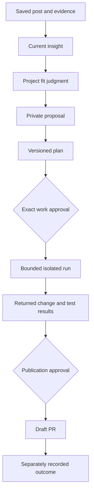

# VibeScroll UI and UX redesign plan

Mode: explanation. Date: October 8, 2026. Status: **draft implementation plan; refinement choices pending**. The owner selected the earlier design 2 for Library and design 3 for Projects, rejected design 1, and requested five mobile actions with Save in the center. These are confirmed constraints. No app code, new design-system contract or production UI is changed by this plan.

Baseline: documentation main `833917db6c149d7d54456b35bd71df815a60f313`; last recorded serving frontend `41a9b286840ed5508c0a10f7c5966fbeec42b790`. See the [implementation inventory](../PROJECT-IMPLEMENTATION-SNAPSHOT-20261008.md) for existing behavior and open V1 gates, and [ADR 094](../adr/094-vertical-library-and-project-trail-direction.md) for owner-selected direction.

## Decisions and open choices

| Item                | Decision                                                                                                                       |
| ------------------- | ------------------------------------------------------------------------------------------------------------------------------ |
| Library             | Build on design 2's vertical knowledge atlas, not the rejected collection desk                                                 |
| Projects            | Use design 3's source-to-proposal-to-change trail; harmonize its components with Library                                       |
| Mobile navigation   | Home, Library, Save, Projects, Account; Save is the center action                                                              |
| Account destination | Profile, Connections, Usage, Billing, privacy, notifications and sign-out; retain direct routes                                |
| Product language    | Post, insight, category, project, proposal, plan, change and result; GitHub issue only at the explicit publication destination |
| Main purpose        | Recognize what was saved, understand what was learned, and optionally review how it could help a project                       |
| Visual identity     | Design 2's bright, calm visual language is the starting point; existing charcoal styling is not binding                        |
| Startup, pending    | Proposed default: first visit shows overview; later visits restore the last valid scope/branch/position                        |
| Theme, pending      | Proposed default: bright mode with a matching optional dark mode; ask the owner before freezing this                           |
| Scope boundary      | Design planning only. Final composition and implementation remain a later step                                                 |

Pending questions are preferences, not approvals for spending or account access. If unanswered, these defaults remain labeled assumptions. Do not interpret elapsed time as acceptance.

## New mockups

All four are native imagegen composition studies with illustrative content, not screenshots or tested interfaces. Their [exact prompts](concepts/20261008-refinement/prompts.json) are retained. Generated logos, source covers, counts and extra descriptions are placeholders; existing original Scroll artwork is retained unless a separate artwork change is chosen.

| Refinement               | Preview                                                         | What to evaluate                                                                       |
| ------------------------ | --------------------------------------------------------------- | -------------------------------------------------------------------------------------- |
| R1: mobile overview      | [Image](concepts/20261008-refinement/mobile-atlas-overview.png) | Readable branching structure, five actions, selection and existing proposal connection |
| R2: mobile focused path  | [Image](concepts/20261008-refinement/mobile-atlas-focus.png)    | Deeper navigation without squeezing a broad canvas onto the phone                      |
| R3: desktop Home         | [Image](concepts/20261008-refinement/desktop-home.png)          | Useful statistics, vertical knowledge preview, next decision and separate work stages  |
| R4: mobile project trail | [Image](concepts/20261008-refinement/mobile-project-trail.png)  | Evidence-to-proposal relationship, honest future stages and review before preparation  |

Recommended combination: R1 for overview, R2 inside a branch, R3 for Home and R4 for project detail. These are views of one system, not four separate visual identities. Keep R2's card copy shorter than the generated sample. The Home sample assumes combined browsing was explicitly confirmed; it does not authorize combining real Personal/Business knowledge. Its numbers are illustrative and not validated metrics.

## Screen architecture

### App shell and navigation

Mobile has five equally understandable labeled controls: **Home · Library · Save · Projects · Account**. Save is a centered prominent action with two destinations on each side. It opens capture; it is not a page with a persistent selected state. The current destination stays selected underneath it. Account is a labeled destination, not a mystery avatar. Pending decisions appear on Home and in an accessible inbox/notification entry; replacing the old navigation must not remove that capability.

Desktop has a compact rail for Home, Library, Projects and Account, a visible Save action, search and a workspace/private-library selector. Connections stays reachable through Account and through contextual setup links. Retain direct-link compatibility with current source, project, usage and connection routes. The older mobile navigation in [Dashboard and mobile UX](../DASHBOARD-AND-MOBILE-UX.md) is superseded for the future shell, not retroactively changed in production.

The bottom bar respects safe areas and never covers the last card, approval button or validation message. The capture sheet respects the software keyboard. Preserve unsaved text and upload selection through authentication review and ordinary navigation. A control opens once, has an obvious close/back path and returns focus to its trigger.

### Library

Personal and Business are the two recognizable top roots. The header identifies the actual private library or selected team-shared scope. Unfiled material has an honest Unsorted entry, not an inferred Personal/Business assignment. Combined browsing remains an explicit separate decision. Showing two root controls does not automatically load both scopes.

Overview shows the top two meaningful levels of a bounded branch. Expand a node to reveal its children; large sibling sets become vertical rows with a load-more control. Clicking an insight selects it. Desktop reveals cited detail and project uses beside the atlas; phone shows a focused path and opens detail in a full-height page or sheet. Search results show their category path and can reveal the match in context.

Offer an Overview action and breadcrumbs; restore the prior path on return. The focused view is not a replacement flat list: indentation, parent labels and fine connectors keep ancestry visible. At deep levels, shorten the breadcrumb rather than progressively squeezing cards. Existing twelve-level parent limit stays enforced; do not imply unlimited semantic depth.

Connections is a secondary selected-insight or topic view. Show only exact existing cited relationships, with a readable explanation and alternative list. Do not open the global circular graph by default or infer all-to-all edges from a shared group.

### Post and insight detail

A post shows original material, actual processing state and its distinct cited insights. An insight starts with one clear claim, type, source/evidence action and uncertainty where material. Current project proposals follow below. Transcript, model/version data and correction history are secondary, not repeated on every card.

Keep existing timed-video, numbered-image and untimed-note evidence behavior. A missing/expired preview uses a clear fallback while retained authorized evidence remains usable. A click on evidence must not silently start reprocessing. Edits use existing version/currentness fences. After a source correction, stale summaries and proposals show a review-needed state.

### Projects and proposals

Project list uses friendly project names with actual stage counts and contextual setup states. Missing connection or confirmed context prompts the next supported setup step; browsing the library does not require GitHub.

Project detail groups proposals into To review, Planned, Working, Change ready, Done and Paused where those labels correspond to real states. A no-fit, already-implemented, deferred or needs-context evaluation stays visible in an appropriate secondary group. It is not converted into a positive proposal just to populate the UI.

Proposal detail follows this vertical trail:

Future steps remain outlined, not checked. The primary action depends on the actual state: review fit, review preparation, review plan, review returned change or review publication. A missing plan cannot show Review plan as though one exists. Opening a preparation review is not starting inference. Repository/base/plan/executor/funding/max-spend authority stays visible on the relevant action review. Product jobs never acquire automatic merge/deploy permission from the new wording.

### Home

Home answers: What is in my library? What is ready? What needs a decision? Start with three or four useful cards, a small knowledge overview, one useful next action, processing exceptions and recent saves. Desktop groups these into a main area and a narrower action area; phone stacks them with current attention first. Empty Home offers Save a post, not charts filled with invented values.

Candidate metrics require explicit definitions:

| Metric              | Definition and scope                                                                         | Click destination           |
| ------------------- | -------------------------------------------------------------------------------------------- | --------------------------- |
| Saved posts         | Unique current sources visible in the selected owner scope; never sum overlapping categories | Matching Posts view         |
| Ready insights      | Current authorized analyzed insight identities, not independently validated unique facts     | Matching ready-insight view |
| Proposals to review | Current private proposals with a real review-needed state and authority                      | Filtered project proposals  |
| Changes ready       | Returned validated changes awaiting their actual review; not merges or benefit               | Review queue                |

Initially preserve loaded-cohort labels until exact aggregate correctness and cost are demonstrated. Exact owner-library totals can replace them only with a tested bounded projection. Shared/team views must not reuse unscoped owner totals. Show Not loaded/Unavailable where coverage is absent; unknown is not zero.

A readiness visualization compares **posts with posts** in the same scope and snapshot: saved, ready, used in a proposal. It is a current-state progression, not a conversion funnel or time-series. Insight counts belong in a separate metric. Project-stage bars distinguish proposals, plans, runs and PRs; do not count each as the same unit. Trends and measured benefit charts wait for actual suitable historical/outcome data.

### Save, Account and first use

Reuse existing paste/upload/import/rights flows in one capture surface. Show supported acquisition states, actual provider/allowance review and no silent paid fallback. Unsupported source recovery stays reachable. Success shows the real saved item and its actual processing state, not a pretend completed analysis.

Account provides Profile, Connections, Usage/Billing, notifications/inbox and Privacy. Connections uses short clear provider cards with actual connected/expired/review-needed states. Assistant scope remains Off, Personal, Business or Both with current/future inclusion, expiry and revoke clearly stated. It does not grant spending, coding, publication or repository code. Events and unsupported provider capabilities remain gated.

First use should lead from intended focus to one permitted saved post, real cited result and its place in the Library. Optional application to a project comes afterward. Preserve the ordinary allowance and owner-only retention exception rather than implying universal free processing. Any upgrades follow the current truthful result-before-payment direction; earlier-payment experiments are excluded.

## Shared interaction and visual rules

- Use one readable sans family and coherent component sizing. Cool light surfaces, navy text, teal selection and restrained yellow Save are the starting palette; verify actual contrast rather than relying on the pictures.
- Personal/Business identity and states have text/icons as well as color. Pending, stale, error and unavailable never look completed.
- Category cards have short labels and expansion controls; insight cards have a concise claim and evidence action. Source previews are permitted assets with predictable fallback, not private provider hotlinks.
- Membership branches are quiet solid lines; related knowledge is subtle/dotted and contextual; actual proposal use is a directional accent. Do not label every membership line or connect unrelated cards for decoration.
- Rename/move/pin, versions and technical identifiers can use item menus. Evidence remains easy to find. Cost, access, expiry, destruction and publication facts remain visible when needed.
- Short transitions, provisionally 150–250 ms, explain local expansion/selection. No continuous physics, background pulsing, page-load choreography or forced smooth scrolling. Reduced motion makes transitions immediate.
- Selection and focus are distinct. Keep a readable semantic outline/list alongside decorative lines. Prefer native disclosure/buttons; adopt ARIA tree semantics only if the full keyboard model is implemented and verified.
- Aim for 44 CSS-pixel interactive targets as the product's design goal. This is stronger than WCAG 2.2's 24-pixel minimum/spacing criterion and must not be described as that criterion's exact rule.

## Data and cost design before UI implementation

Proposed primary hierarchy: **virtual Personal/Business roots from source filing → existing knowledge topics and their saved parent links → current insight memberships**. Preserve existing whole-post categories as tags; do not merge two taxonomies merely because their names look similar. The hierarchy uses existing topic IDs and versions; topic terminology becomes category/subcategory in the presentation. A structural alias or move does not rerun analysis.

An insight may appear through several memberships. Use scope/topic/membership identities for its displayed occurrence and its canonical source/generation/revision/insight reference for evidence and deduplication. Cross-links point to existing canonical records. A topic visible in both roots is not a duplicated stored topic. Partial/off-page parents must have a scoped load path or an explicit missing-context state, never an invented parent.

Before adopting this mapping, test topic labels and derived summaries against the selected scope. Current mixed/stale input rules still apply. Never disclose hidden titles, claims, counts, IDs or cross-scope relationships through the tree or a supposedly harmless statistic. Changing tabs does not change a grant.

Reuse indexed, bounded projections and pagination. Existing topic lists use thirty-record pages and evidence batches use twelve memberships; do not silently expand them into whole-library downloads. New child/ancestor reads, if necessary, require a documented bounded index and an authority review. Debounce search, cancel obsolete reads and reject late responses after workspace/scope changes. Local layout, expansion of cached data, menus and theme changes require no inference or subscription polling.

For exact owner-only totals, compare incremental aggregates with bounded snapshot verification. Changes from source creation/deletion, readiness transitions, revisions and filing must update counts transactionally or expose a rebuilding/unavailable state. Avoid per-viewer materialized copies and all-customer rescans. Shared views can keep explicit paginated-cohort statistics until a correct bounded alternative exists.

Budget efficiency is measured, not assumed: record request count, payload, database read/write consumption where available and matched-workload provider estimates. Smaller JSON alone is not lower Convex billing. Preserve the cumulative EUR 2 finish ceiling, all existing caps and unknown holds. Model/API/sandbox work requires its existing action review; this plan creates no paid work.

## Implementation phases and acceptance

| Phase                               | Work                                                                                                                                                        | Required evidence before advancing                                                                                                                         |
| ----------------------------------- | ----------------------------------------------------------------------------------------------------------------------------------------------------------- | ---------------------------------------------------------------------------------------------------------------------------------------------------------- |
| UX0: resolve refinements            | Confirm startup/theme and whether overview plus focus is the chosen interaction; turn selected mockups into state specifications                            | Owner choices recorded; imagery remains illustrative; no coding before the planning boundary is lifted                                                     |
| UX1: validate hierarchy and metrics | Inventory current fields/indexes/roles; validate the virtual-root/topic/membership mapping, tags, counters, late-response rules and representative fixtures | Current IDs/manual edits/export/deletion preserved; scoped negative tests; sparse, deep, wide and overlapping memberships; documented query bounds         |
| UX2: shell, Save and Account        | Implement five mobile actions, desktop rail, keyboard-safe capture and coherent Account destination with preserved direct links                             | Correct action/destination semantics, unsaved-draft recovery, direct links, focus return, safe-area/keyboard checks                                        |
| UX3: Library atlas and evidence     | Build overview/focused path with deterministic local layout, breadcrumbs, pagination, search reveal, cited detail and contextual project arrows             | No clipping/mandatory zoom, no invented parents or edges, current evidence and original image/timestamp behavior, scope-reset/stale-read tests             |
| UX4: Projects and reviews           | Build project list and state-derived vertical proposal trail; simplify language and advanced panels                                                         | Every primary action matches a real state; no-fit retained; exact plan/patch/funding/publication authority enforced server-side                            |
| UX5: useful Home                    | Build selected-scope stats, knowledge preview, next action, readiness and work-stage visualizations; introduce exact totals only after UX1 acceptance       | Correct units/cohorts/deduplication, unknown distinct from zero, accessible filter links, matched-read/cost evidence                                       |
| UX6: first use and consistency      | Complete coherent capture/result/optional-project journey; apply chosen theme, empty/error/stale states and restrained Scroll presence                      | Real result or truthful blocked state; all main screens coherent; no new marketing or free-processing claims                                               |
| UX7: release and acceptance         | Required checks, bounded browser review, fix batch, exact CI/version/deploy/domain checks; retain rollback                                                  | Local/staging/production receipts separated; fixed Basic queued builds; exact application version; human/physical checks remain unpassed where unavailable |

Default sequence builds data truth before visual claims, then the shell, Library, Projects and Home. Each phase is a small reviewable change; avoid a simultaneous backend migration and whole-app replacement. Extend the existing architecture first. A new layout library is justified only if it solves measured problems more simply than the current deterministic DOM/SVG layout; do not switch frameworks to match a mockup.

Actual inspected starting points, not promises that these files contain the whole workflow:

- Shell and capture integration: `apps/starter/components/console.tsx`, `apps/starter/app/studio.css`.
- Library and evidence: `private-library.tsx`, `library-explore.tsx`, `knowledge-library.tsx`, `knowledge-canvas.tsx`, `knowledge-map.tsx` under `apps/starter/components/`; helpers under `apps/starter/lib/knowledge-layout.ts` and `knowledge-map.ts`.
- Home: `studio-home.tsx`, `dashboard-visuals.tsx`, `dashboard-trace.tsx`, `apps/starter/lib/dashboard-visuals.ts`.
- Connections/sharing: `assistant-connections.tsx`, `team-knowledge-sharing.tsx`, `shared-knowledge.tsx`.
- Backend: `convex/librarySpaces.ts`, `knowledgeExplore.ts`, `knowledge.ts`, `knowledgeGrants.ts`, `knowledgeSchema.ts`, `dashboard.ts`, `lib/dashboardProjection.ts` and `lib/knowledgeReadContext.ts`.

Inspect actual route contracts and existing tests before splitting components or adding endpoints. Maintain the original foundation authentication, provider and billing paths.

## Acceptance scenarios

1. New empty user can find Save, understand actual processing requirements and reach a real result or an explicit blocked state. An owner-controlled second account cannot substitute for independent first-use acceptance.
2. A library with one source, missing parents or unfiled items remains useful. A twenty-idea sparse topic starts at its content rather than a blank canvas. Deep paths and large sibling pages stay readable without horizontal document overflow.
3. Search reveals a current insight in context; back/close restores branch, scroll and focus. Later visits restore only valid authorized state. Persisted view preferences must not contain source text/tokens and must be cleared appropriately on sign-out/account changes.
4. One insight in several categories is not double-counted as several insights or sources. A current-source correction/deletion/revocation clears stale detail and project arrows. Viewer scope cannot reveal another owner's evidence or hidden totals.
5. Save is centered among five labeled actions, opens capture and preserves the current page. Navigation, browser back and a software keyboard do not erase an unsaved draft or cover its error/action controls.
6. A proposal with no plan offers preparation review, not execution. Changed base, plan, evidence, provider rights, executor or cost authority invalidates the relevant action. Opening detail or viewing the trail starts no paid work.
7. All displayed Home values resolve to the matching permitted records. Post-stage values use the same post cohort; insights, proposals and PRs are not mixed into one funnel. Missing data stays unavailable. Merge remains distinct from benefit.
8. Keyboard and touch users can expand, select, inspect evidence and return. Test focus, reduced motion, contrast, 200% zoom, long labels and screen-reader structure. Viewport emulation is not physical-device or AT acceptance.
9. Matched cold/warm navigation records show bounded reads without continuous polling, inference-on-open or silent full scans. Cost reports distinguish delayed team estimates, included allowance and attributable settled task spending.

Use meaningful state/provenance/permission regressions and browser journeys rather than tests that only mirror styling. Batched viewport review: 320/390 mobile, 768 tablet, 1440 desktop; check safe-area/keyboard and actual devices separately where available. Inspect once, fix the observed batch, confirm once. Record remaining failures instead of polishing indefinitely.

## Release, rollback and separate gates

When implementation is authorized, run formatting, validation, lint/types, unit/integration/auth tests, relevant Python/build-policy checks, both builds, dependency triage and redacted secret scanning. Required exact-head and main CI must pass. Deploy only changed application/backend slices, retain fixed Basic builds and verify the canonical domain plus exact version. Keep a known-good application rollback; additive schema/index changes must remain compatible and preserve archives/private configuration. Documentation-only changes can skip deployment under ADR 033.

The backup resume failure observed October 8 is a separate operational issue: export/encryption/upload succeeded, but the later resume and final artifact step failed. Investigate before relying on that new run for a migration/recovery gate; do not extend expiry or rerun paid/provider work merely to obtain a green result. Prior verified archives are dated evidence, not proof of this run. This UI plan does not authorize a repair implementation.

Independent comprehension/relation quality, genuine eligible first use, natural grant expiry/mixed evidence, supported-host Events, restricted/multiple provider installation/revocation and applicable commercial/invoice/recovery gates remain distinct. Physical Android retains its recorded V1.1 deferral. Attractive screenshots cannot close these gates or complete full V1. V2, autonomous businesses, campaigns and deferred experiments are excluded.

## References and how they are used

| Reference                                                                                                                                                  | Design use                                                                                            | Boundary                                                             |
| ---------------------------------------------------------------------------------------------------------------------------------------------------------- | ----------------------------------------------------------------------------------------------------- | -------------------------------------------------------------------- |
| Owner's two original diagrams and selected designs 2/3                                                                                                     | Vertical knowledge organization and source-to-project arrows; owner preference controls the direction | Not copied artwork or implementation evidence                        |
| [Earlier VibeScroll options](vibescroll-layout-options-20261008.md)                                                                                        | Historical comparison and previous prompts                                                            | Design 1 is rejected; retain history rather than promoting it        |
| [Milanote nested boards](https://help.milanote.com/en/articles/9860073-nesting-boards)                                                                     | Breadcrumbs and progressively opening nested context                                                  | Do not inherit its nested sharing model or require drag arrangement  |
| [Heptabase 1.0](https://wiki.heptabase.com/version-one)                                                                                                    | Nested knowledge structure, arranged mind maps and readable custom relationships                      | No claims about VibeScroll matching its speed or features            |
| [NN/G progressive disclosure](https://www.nngroup.com/articles/progressive-disclosure/)                                                                    | Secondary panels for less-used controls                                                               | Cost/access/approval facts stay visible                              |
| [WAI tree-view pattern](https://www.w3.org/WAI/ARIA/apg/patterns/treeview/)                                                                                | Expand/collapse, keyboard model and distinct focus/selection if an ARIA tree is used                  | No partial ARIA implementation masquerading as accessible navigation |
| [WCAG target-size guidance](https://www.w3.org/WAI/WCAG22/Understanding/target-size-minimum.html)                                                          | Touch spacing and target acceptance                                                                   | Internal 44-pixel goal is not the standard's 24-pixel minimum        |
| [Material navigation bar](https://m3.material.io/components/navigation-bar/guidelines)                                                                     | Conventional labeled bottom-navigation reference                                                      | Five items are the owner's choice; center Save remains an action     |
| [Saved taste/component-refinement analysis](https://scroll.companynerve.com/app/nn7d15ckc9p6xsx0z7sd09w7298fey3s/library/px72c971wybs6b657cm3a3rmns8ffrg5) | Refine representative components and carry decisions consistently                                     | Creator advice; authenticated source; no customer-value claim        |
| [Saved mood/reference analysis](https://scroll.companynerve.com/app/nn7d15ckc9p6xsx0z7sd09w7298fey3s/library/px7bgyq7s4ghq43y5htnr0znbh8ffjcn)             | Compare coherent compositions before committing                                                       | Partial prior search, not exhaustive research                        |

Impeccable's shape/Operate guidance informed planning, state coverage and restrained motion. The design-space skill informed the overview-versus-focus comparison; native imagegen produced the mockups. Existing UI UX Pro Max is available for implementation review. No new taste skill was installed. [Taste Skill](https://github.com/Leonxlnx/taste-skill) can provide selective redesign critique, but its current main skill excludes multi-step product UI; do not let it replace this product-specific plan.

## Next decision

Review the four refinements and answer startup/theme preferences. The plan's confirmed structural choices stand; remaining composition assumptions can change. Freeze a state-by-state specification after that review, then begin implementation only when requested. Until then, the live interface and all provider/funding authority remain unchanged.
