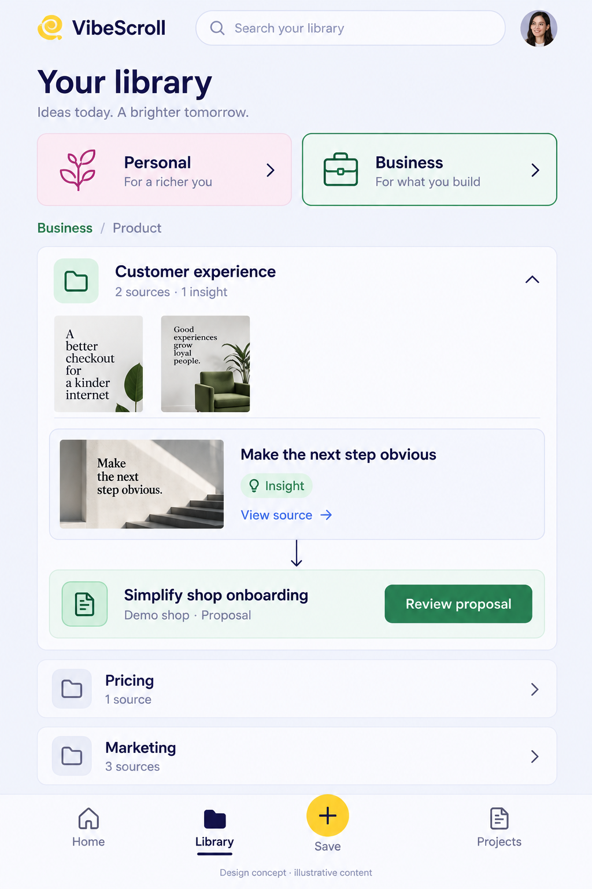
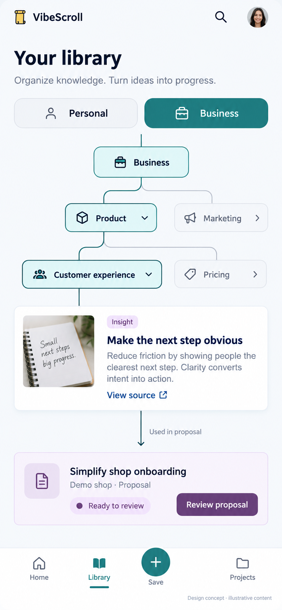
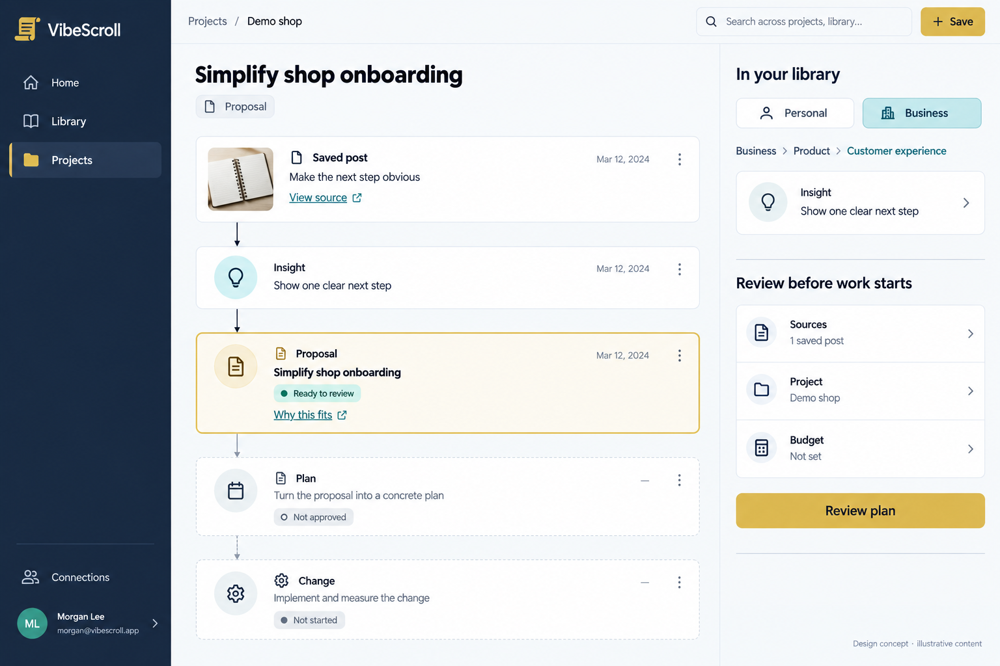
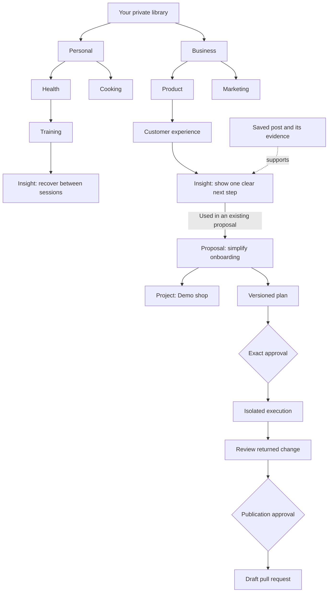

# VibeScroll layout options, October 8

Mode: explanation. Status: **unapproved design exploration**. No application code or existing design contract changes are authorized by this document. The owner requested concepts before implementation and explicitly allowed a new visual identity beyond the current system.

Owner selection addendum, October 8: design 2 is preferred for Library, design 3 for Projects, and design 1 is rejected. Future mobile navigation has five controls with Save centered and Account on the right. See the [draft redesign plan and refinements](VIBESCROLL-UI-UX-PLAN-20261008.md). The original alternatives below remain historical; their images are not implemented interfaces.

See the separate [implementation snapshot](../PROJECT-IMPLEMENTATION-SNAPSHOT-20261008.md) for what actually exists. All mockup covers, dates, avatars, counts, project names and wording below are illustrative, not customer data, measured outcomes or enabled-feature promises.

## Recommended experience

Use a **vertical knowledge atlas for the Library**, **recognizable visual cards for its content**, and a **proposal trail for Projects**. Home should help someone choose a useful next action. It should not require understanding a graph before saving or finding something.

The intended realization is: “That post taught me this; it belongs here; I can see what it could change.” A library-only user gets the first two benefits without connecting GitHub. A project owner can follow the third through explicit review.

The owner’s constraints are fixed: Personal and Business at the top, meaningful categories and subcategories underneath, automatic attractive arrangement, clear connections to project proposals, fewer descriptions and easy navigation. Colors, typography, spacing, artwork and component styles are open for discussion.

## Three different directions

| Direction                   | Main experience                                                                                              | Strongest benefit                                                               | Tradeoff                                                                     |
| --------------------------- | ------------------------------------------------------------------------------------------------------------ | ------------------------------------------------------------------------------- | ---------------------------------------------------------------------------- |
| A: visual collection desk   | Recognizable nested collections and source covers; open a collection to reveal its insights and project uses | Familiar, inviting and easy to recognize remembered material                    | Relationships are less explicit until a card is opened                       |
| B: vertical knowledge atlas | Expand a tidy downward hierarchy; selected insight reveals evidence and real project connections             | Closest to the requested tree and clearest explanation of where an idea belongs | Needs disciplined folding and branch focus as the library grows              |
| C: proposal trail           | Follow saved post → insight → proposal → plan → change in a project journal                                  | Makes the connection between learning and action visible                        | Should not dominate the first experience of someone who only wants a library |

### A: visual collection desk

Personal and Business feel like recognizable collections. Categories have restrained cover mosaics drawn from permitted source previews; text notes have a typographic cover. Opening a category presents its subcategories and insights in a neat automatic arrangement. Nobody needs to drag cards around to make it attractive.

On desktop, a narrow collection navigator, spacious card area and optional selected-insight panel form three clear regions. On a phone, nested collections stack vertically and a breadcrumb remembers the route back. The selected insight opens an evidence view or displays its existing proposal underneath. The hierarchy is communicated by grouping and nesting rather than an always-visible forest of lines.

Visual direction: cool pale lavender, deep indigo text, green Business and rose Personal accents. Source previews supply variety. A small original Scroll mark adds character without becoming a large decorative block.

Use this if quick recognition and relaxed collecting matter most. Do not copy the generated slogan or illustrative counts into production; shorten unnecessary descriptions and use truthful permitted previews.

### B: vertical knowledge atlas

This is the recommended structural direction. Personal and Business stay at the top. Beneath the selected root, categories descend into subcategories and insights. Nodes are readable small cards; thin curved branches explain membership. The selected branch receives color while collapsed siblings remain quiet.

On desktop, the tree occupies the main area. An insight panel appears on the right, with existing linked projects in a narrow adjacent lane. On a phone, the branch is a vertical reading path; the linked proposal appears below the insight, so ordinary scrolling works. Zoom is optional, not a prerequisite.

Opening a branch should center the newly revealed content only when needed, keep the previous context visible and retain the route back. Selecting another branch should not reset the whole map. A compact breadcrumb and “Back to overview” are more useful than a permanent large minimap on a small screen.

Visual direction: bright cool-white surface, navy typography, teal selected path, restrained root accents and small yellow Scroll identity. Avoid rendering a separate duplicate root card directly underneath an already selected root if it adds no navigation value. The generated sample is a composition study, not final copy or exact responsive sizing.

Use this if understanding how knowledge connects is the central promise. Show one expanded path and limited nearby siblings by default; expanding every node would recreate the current flatness and crowding.

### C: proposal trail

Projects become readable journals rather than technical issue lists. A proposal shows the source, extracted insight, project-specific suggestion, reviewed plan and returned change in a vertical trail. Future stages are outlined and explicitly unstarted. An accepted proposal, approved plan, completed job, merged PR and measured benefit are separate states.

On desktop, a calm navy navigation rail and bright work area frame the trail; the right panel shows the relevant library path and the actual review requirements. On a phone, the trail is one column with the current action near its stage. Evidence and past decisions remain available without expanding a paragraph under every row.

Visual direction: navy, chalk and restrained amber for attention. Borrow the clarity of a departure board: named stages, stable identities and an obvious next action. Do not borrow flight numbers, all-capital jargon, animated split-flaps or live polling.

Use this for project detail even if B becomes the main library. The image’s “Review plan” is illustrative: if no plan exists, the real action must be “Prepare plan” with its quote, or an explicit blocked state. Never imply a missing plan is ready, that a budget is set, or that a change automatically measures its own benefit.

## The hierarchy and its connections

This is a proposed explanatory example, not the current database diagram or a completed customer journey. Category arrows mean “filed under”; evidence links mean “supports”; proposal arrows mean “this current insight was actually used here.” Similarity alone must not create a “used in proposal” edge.

Use three visual treatments:

- **Membership:** quiet solid branch, no repeated label on every line.
- **Related knowledge:** subtle dotted connection, revealed for the selected insight or an explicit Connections view. Related does not mean agrees or proves.
- **Project use:** a directional accent arrow to a persisted proposal/reference. A suggestion without a proposal uses “Check fit” instead, with its processing review when needed.

A single source can contain several insights. An insight can belong to several topics; showing it in two paths must not duplicate the source or double-count it. Corrections and deletion invalidate outdated evidence and linked authority. A stale proposal should show “Sources changed” and a review action rather than quietly retaining a green state.

Private-library scope appears before the tree. Team-shared knowledge uses a clearly separate selector. Personal/Business is a filing distinction, not a substitute for private ownership. Combined exploration must follow the existing explicit combined-scope decision. Changing a view does not expand an assistant grant or share anything with teammates.

## How navigation stays easy

Default to two visible hierarchy levels, then expand the chosen path. Large sibling sets become a vertical list or compact category cards, not an ever-wider row. Show a truthful expandable indicator where children are not loaded; do not mistake one page for an entire branch. Search results show the matching item and its path, then reveal it in context.

Every node has a short title, a recognizable type and at most one useful hint. Selecting an insight reveals its source and project use. Opening evidence uses the existing cited detail experience. Tap targets remain large enough; dragging, hovering and pinching are optional. The tree has an equivalent keyboard-accessible outline/list view.

Remember expansion, selected scope, search and scroll position locally where appropriate. Persist semantic filing/pins through the authorized application path. Returning from an insight should restore the previous branch, not return the user to the top of the library.

## Main screens

| Screen             | What users see first                                                                                              | What is secondary                                                       |
| ------------------ | ----------------------------------------------------------------------------------------------------------------- | ----------------------------------------------------------------------- |
| Home               | One useful next action, recently saved material, relevant ready proposals or paused work, compact truthful counts | Expanded statistics, history and coverage details                       |
| Library            | Personal/Business roots, focused vertical hierarchy, source/insight cards and search                              | Posts view, Connections, versions and collection management             |
| Saved post         | Original material, processing state and its useful cited insights                                                 | Transcript, detailed model/version record, export and retry diagnostics |
| Insight            | One clear claim, visible source/evidence link, related ideas and existing project use                             | Full explanation, correction history and advanced organization          |
| Projects           | Friendly project names and proposals grouped by current state                                                     | Repository identifiers, installed provider details and snapshots        |
| Proposal           | Why it fits, cited sources, actual proposed change and one appropriate review action                              | Alternatives, detailed context, technical exclusions and versions       |
| Plan/change review | Concrete work/returned patch, tests, funding route, maximum spend and exact approval                              | Full logs and advanced execution details                                |
| Connections        | Clear provider cards, actual connection state, library scope and expiry                                           | Detailed scopes, installation IDs and technical troubleshooting         |
| Account            | Usage, Billing, privacy/export/delete and sign-in controls                                                        | Operator/provider diagnostics where authorized                          |

Desktop navigation: **Home, Library, Projects**, plus a prominent Save button. Connections and account live behind the avatar/settings area unless a current setup task needs them. Mobile navigation: **Home, Library, Save, Projects**. Avoid five competing visualization modes in the primary navigation.

Home should not become a second library or a chart gallery. A compact collection-readiness bar and proposal-stage bar can help someone choose their next step. A trend chart requires real comparable dated data. A benefit chart requires actual outcome measurements; merged PRs and accepted ideas are not a benefit metric. Aggregate labels must name their scope. Optional stats can open a dedicated panel if the owner wants a richer analytical dashboard.

## Friendly language and fewer descriptions

| Product term        | Meaning                                                       |
| ------------------- | ------------------------------------------------------------- |
| Post                | Something the person saved                                    |
| Insight             | A useful point with source evidence                           |
| Collection/category | A place to organize knowledge                                 |
| Project             | What the person is building; repository details are secondary |
| Proposal            | A possible project change awaiting a decision                 |
| Plan                | Specific versioned work to review                             |
| Change              | Returned implementation or draft PR, with its real stage      |
| Result              | A separately recorded outcome, not assumed benefit            |

Keep “GitHub issue” for the explicit publishing destination, for example “Publish as a GitHub issue.” A private proposal must not look already published. Existing internal table names can remain technical; a presentation rename does not require unnecessary data migration.

Use short labels and contextual detail. Put move/rename/pin, versions, exclusions and technical identifiers in an item menu or details panel. Keep citations accessible in one obvious action. **Do not hide spending, access scope, expiry, execution authority, destructive consequences or publication destination in an advanced menu.** Those are facts a user needs before deciding.

## Automatic beauty and bounded backend use

Attractive defaults come primarily from deterministic layout, typography, grouping, thumbnail treatment and restrained color. They do not require an AI call each time a person opens a screen.

- Size cards for readable titles; use consistent vertical spacing and stable branch ordering.
- Lay out only the loaded branch and its immediate context. Preserve positions when background state changes; animate a local transition rather than restarting the whole graph.
- Use quiet synthetic-free fallback covers for text/unavailable media. Source previews remain permission-checked, not hot-linked private provider assets.
- Use short branch transitions only to clarify movement; respect reduced motion. Avoid continuous physics, pulsating backgrounds and scroll hijacking.
- Compute geometry and selection locally. Reuse current paginated projections and load detail on demand. Opening a menu or rearranging a tree must not trigger inference or polling.
- Exact global totals need an explicit permission-aware aggregate design. Do not scan every source or insight on each dashboard visit. A smaller JSON response alone does not prove lower Convex charges.

The existing model separates whole-source categories from insight-topic memberships. A unified tree needs a compatible presentation/indexing design, not a blind reset of the corpus. Existing manual names, moves, parent choices, merges, pins, exclusions, IDs, revisions and grant boundaries must survive. Automatic **layout** is free local organization; new semantic **classification** still follows the reviewed bounded organization policy. Unfiled items need an honest Inbox/Unsorted destination. The app must not guess that something is Personal or Business in a way that changes disclosure.

## First-use experience

Start with what the person wants to keep or improve, then help them save one permitted post. Show useful cited insights and where they belong. Offer a project only when the person wants to apply something. GitHub is optional for collecting knowledge.

If processing needs a provider, allowance or approval, show the actual requirement and quote; do not simulate a successful first result. Existing onboarding and owner-only retention exceptions are not a universal free-processing offer. The new layout needs a genuine first-use test once an eligible consenting tester is available.

## References and free skills

Primary product references support specific interaction ideas, not a mandate to clone another app:

- [Milanote home organization](https://help.milanote.com/en/articles/6978839-organizing-your-home-board) shows Personal/Work organization and project stages. [Nested boards](https://help.milanote.com/en/articles/9860073-nesting-boards) support drill-down and breadcrumbs. Its sharing inheritance must not replace VibeScroll’s access rules.
- [Heptabase organization](https://wiki.heptabase.com/organize-knowledge-and-projects) and [version-one overview](https://wiki.heptabase.com/version-one) provide references for nested knowledge spaces and arranged mind maps. VibeScroll should provide more automatic defaults and less mandatory canvas management.
- [Progressive disclosure](https://www.nngroup.com/articles/progressive-disclosure/) supports showing common actions first and moving less-used controls into an obvious secondary layer. Important authority and cost facts stay visible.

| Free skill                              | Verified source/license                                                                                                                                                                                                    | Fit for this task                                                                                                                                                                   |
| --------------------------------------- | -------------------------------------------------------------------------------------------------------------------------------------------------------------------------------------------------------------------------- | ----------------------------------------------------------------------------------------------------------------------------------------------------------------------------------- |
| Impeccable                              | [Source](https://github.com/pbakaus/impeccable), Apache 2.0; already installed                                                                                                                                             | Main planning, critique and product-interface workflow                                                                                                                              |
| UI UX Pro Max                           | [Source](https://github.com/nextlevelbuilder/ui-ux-pro-max-skill), [MIT license](https://github.com/nextlevelbuilder/ui-ux-pro-max-skill/blob/main/LICENSE); already installed                                             | Interaction, accessibility and visualization guidance                                                                                                                               |
| Taste Skill: redesign-existing-projects | [Source collection](https://github.com/Leonxlnx/taste-skill), [MIT license](https://github.com/Leonxlnx/taste-skill/blob/main/LICENSE), [skill listing](https://skills.sh/leonxlnx/taste-skill/redesign-existing-projects) | Useful supplementary visual audit. Review prescriptions individually; avoid adding motion or a framework rewrite merely because a prompt recommends them                            |
| Taste Skill: design-taste-frontend      | [Current source](https://github.com/Leonxlnx/taste-skill/blob/main/skills/taste-skill/SKILL.md), same MIT collection                                                                                                       | Current experimental version explicitly scopes itself to landing pages/portfolios/redesigns and excludes dashboards/data tables/multi-step product UI; not the primary app-UX skill |

The October 8 skills.sh snapshots showed roughly 418,000 installs for the redesign skill and 578,000 for the main design-taste skill. Popularity is discovery evidence, not proof of design quality. Instruction files are free; model/image generation and product hosting are separate services. No new skill was installed, and no external skill can override product privacy, approvals or spending restrictions.

Owner saved material also supports the approach:

- [Saved reference on taste and component refinement](https://scroll.companynerve.com/app/nn7d15ckc9p6xsx0z7sd09w7298fey3s/library/px72c971wybs6b657cm3a3rmns8ffrg5): choose appropriate references, refine a few components, then carry the decisions consistently. This is creator advice, not an installable skill or a measured outcome.
- [Saved hand-drawn component reference](https://scroll.companynerve.com/app/nn7d15ckc9p6xsx0z7sd09w7298fey3s/library/px789gjrssvxt3w4a2yk1dxme18ffdtj): possible small expressive details, not wobbly controls or continuous animation. The creator’s free-tool claim was not independently verified against an official license.
- [Saved mood/reference workflow](https://scroll.companynerve.com/app/nn7d15ckc9p6xsx0z7sd09w7298fey3s/library/px7bgyq7s4ghq43y5htnr0znbh8ffjcn): establish a mood before polishing screens and compare alternatives.

The authorized connector searches for taste/design returned relevant results, then refused further reads because current authorization or evidence was unavailable. They were stopped, not bypassed. Search coverage is partial; no exhaustive-library claim follows. No codes or tokens were retained in the research receipt.

## Review boundary

The generated images are native imagegen brainstorming artifacts, not screenshot acceptance. They may contain extra descriptions, invented demo dates/counts or imperfect button-state relationships; the text above defines the intended behavior. Exact prompts are retained in the concept folder. The concepts do not change permissions, create proposals, start paid work, or revise the approved design system.

The next owner decision is the desired combination of structure and visual character. B’s hierarchy, A’s recognizable cards and C’s project trail can form one coherent product; do not combine every decorative motif. After that choice, specify the precise states and testable interactions before implementation.

Owner follow-up: Library starts at overview on first use and remembers the last valid place afterward. Theme follows the device light/dark setting. The [refinement plan](VIBESCROLL-UI-UX-PLAN-20261008.md) records these confirmed defaults and the bounded live review. Final refined compositions remain proposals. The earlier collection-desk comparison stays historical; design 1 is rejected.
